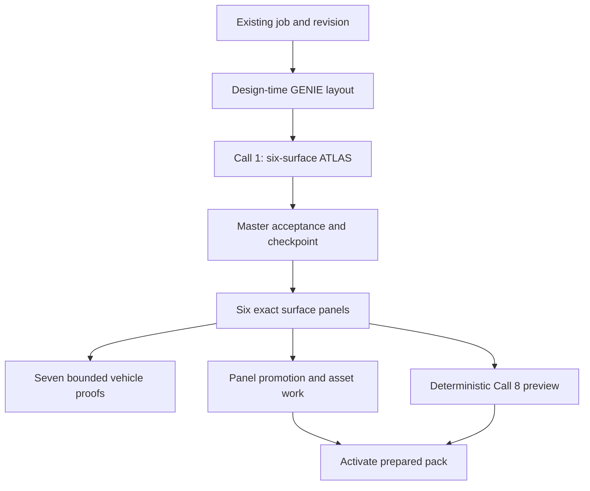
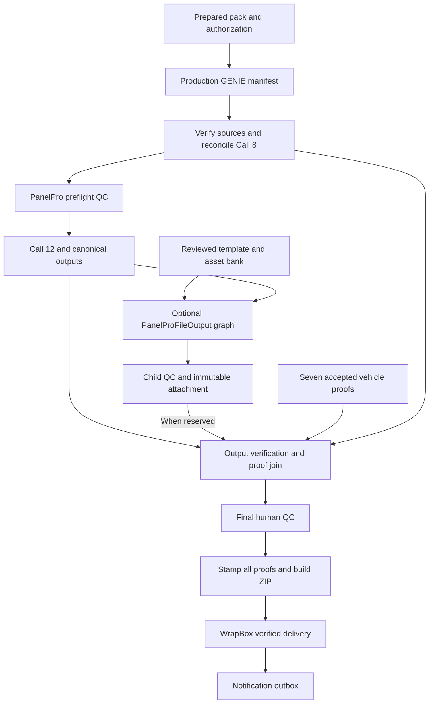

# DesignProAI OS: end-to-end graph and acceptance

Updated: 8 September 2026. Companion specification: [PanelProFileOutput](PANELPROFILEOUTPUT-END-TO-END.md).

DesignProAI remains the operating system. The existing six-surface A.T.L.A.S.
authoring path, identities, version history, studios and delivery flow remain its
foundation. PanelProFileOutput adds a measured output-preparation application to
that system. A separate experiment may compare creative variations, but it may
not replace A.T.L.A.S. or promote a candidate into production automatically.

Version history is already implemented and saved. Preserve the existing
generation/design/order IDs, revision records, `visualization_version_commits`
and ATLAS history. New graph run/node ledgers record execution state against
those identities; they are not a replacement design-history system. A template
profile version records measured geometry and display provenance separately.

This document is both the implementation map and the acceptance ledger. A checked
item means the stated code change has supporting tests. It does **not** mean the
change is deployed, a fresh Gemini generation passed, or a human approved a print
package. Those are separate gates at the end of this document.

## 1. Required result and visual contract

The completed job contains the accepted master, its six canonical panels, seven
vehicle-view proofs, a deterministic dimensioned production proof, original and
extracted reusable assets, nonprinting QC duplicates, approved physical print
pieces, verified output files, stamped proofs, a ZIP and a WrapBox delivery.
Notification follows successful delivery through the existing email outbox.

| Supplied reference | Requirement it establishes |
|---|---|
| Flamingo A.T.L.A.S. sheet | One cohesive design spanning Driver, Passenger, Hood, Roof, Front and Rear; continuous rectangular printed media |
| RevisionStudio screenshots | Keep the seven-view proof area and the panel column on its right; each panel must show its own accepted surface and revision |
| Dimensioned production-proof example | Call 8 contains real GENIE trim dimensions, 5-inch bleed on each outside edge, print dimensions, coverage totals and job identity |
| PanelProStudio screenshot | Keep the existing production control room and paired proof/panel review; repair source selection and lineage |
| Twenty tutorial frames and printing PDF | Template registration, panel rectangles, returns, duplicates, asset reuse, production exports and internal review are required work |
| Body-parts reference diagram | Useful coverage taxonomy, including separate body pieces; its explicitly approximate dimensions are not production measurements |
| Avery Dennison one-panel installation walkthrough | Continuous side artwork, registration before cutting, protected logo clearance, suitable roll orientation and cross-surface alignment need explicit checks |

The areas trimmed away during installation must still contain **nonessential
design/background artwork** in the print file. Logos, lettering, URLs, phone
numbers and other protected content stay away from those areas. Inspection masks
visualize the cuts; they do not erase them from the printed rectangle. Blank,
placeholder-filled or transparent cutout substitutions do not meet this
requirement. A solid black or other solid region already belonging to the design
is valid nonessential artwork; a solid color is not automatically a defect.

Three sets remain distinct throughout the code:

| Set | Meaning | Identity rule |
|---|---|---|
| Six canonical surfaces | Driver, Passenger, Hood, Roof, Front, Rear authored together by Call 1 | Preserve the existing surface keys and master-derived hashes |
| Seven vehicle proofs | Seven existing camera/view roles used to review the design on a vehicle | Driver has dispatch priority; other views need their own artwork inputs, not Driver's completed image |
| Physical printing pieces | Variable count determined by the measured profile, returns, printable width and approved splits | Every piece has its own ID and source surface; never force this count to six |

Nate's supplied printing transcript shows seven physical panels plus a separate
overall proof board. That is eight artboards, not eight production panels or a
replacement ATLAS layout. Physical rectangles cover painted surfaces, excluding
wheel height. A trunk's measured vertical return and each bumper's measured
left/right returns are included before adding this system's 5-inch bleed. The
tutorial's 3-inch bleed, example Camaro dimensions and convenient rounding are
not production defaults. Export each physical PDF separately, leave the overall
proof out of the print-panel set, and identify a 1:10 PDF clearly in its filename.

### Why a clean ATLAS was not reliable end to end

The screenshots show an output problem; they do not by themselves identify
whether the model produced a bad master or a later page selected the wrong
artifact. The code review separated those causes:

| Failure boundary | Repair in this branch | What still needs a real job |
|---|---|---|
| Accepted master versus optionally finished panels | One final accepted master is assembled, checked and recropped before downstream publication | Visual cohesion of a fresh generation |
| Interrupted provider or authoring work | Private exact-response and accepted-master checkpoints recover the same recorded work; uncertain outcomes cannot start an unrecorded new attempt | Live provider timeout/recovery observation |
| Wrong or stale studio panel | Select by existing generation, revision, master, own surface and camera; retain the actual signed image separately from identity | Browser review after edit, reload and recovery |
| Proof looks complete before its sources are complete | Pin the exact seven-view set and deterministic Call 8 at final verification; incomplete or mismatched evidence cannot receive final QC | A complete real output package |
| Installation cuts intersect essential artwork | The separate measured planner moves only verified separable assets and retains real nonessential background | Actual template, layered artwork and installation comparison |

Gemini remains a candidate-producing model. Protocol correctness and thought
signatures do not guarantee a clean composition on every request. The product
guarantee must come from accepting only valid results, preserving accepted work,
showing the matching artifacts, and routing unresolved cases to the internal
team. This branch does not claim every possible design can finish automatically.

## 2. Dependency graph

Generation and preparation can proceed while vehicle-view proofs finish. The
free half uses design-time layout dimensions; the purchase-gated GENIE manifest
remains the authority for production dimensions.



Manufacturing preserves the existing human baseline. A reserved
PanelProFileOutput run can consume a verified high-resolution derivative after
Call 12. Its attachment must arrive before the parent verifies its final set.
Without a reservation, the existing canonical production lane runs unchanged.



Panels and asset preparation may continue while a vehicle proof or Call 8 needs
recovery. A preparation success is not delivery readiness. The final join must
require the actual seven accepted proofs and Call 8 before final approval and
packaging. A deferred or missing artifact cannot satisfy that join.

Existing purchase/entitlement gates still apply wherever the current product
configuration requires them. This work changes no pricing policy. The new graph
must not silently turn a technical feature flag into a billing decision.

## 3. Code map: generation and preparation

| Step / persisted key | Inputs and dependency | Executing code | Output and required check |
|---|---|---|---|
| Request and identity | Authenticated owner, existing source job/design/generation/revision; frozen brief and uploaded assets | `gateway/src/server.mjs`: `validatedGenerationRequest()`, `validatedGenerationRequestV3()`; `runtime/designpro-standalone-claimant.cjs`: `claimCalls1To7Generation()` | Existing `designpro_generation_requests`; owner-scoped immutable references; no browser-selected model, prompt, worker control or arbitrary source path |
| GENIE preparation | Exact vehicle configuration, including body/roof/wheelbase variants | `runtime/genie-prep.cjs`: `createGeniePrepService()`; `runtime/genie-universal-resolver.cjs`: `resolveFlatAtlasPreviewDimensions()`, `resolveOrQueueUniversalDimensions()` | Candidate or validated geometry with evidence; distinguish design-time dimensions from validated manufacturing dimensions |
| Call 1 master | Brief, verified customer references, locked teaching proof, GENIE target guide | `runtime/flat-first-atlas.cjs`: `buildAtlasManifest()`, `atlasEdgeRequestBody()`, `generateOrReuseFlatAtlas()`; `supabase/functions/design-panel-ai-generate/index.ts`: existing ATLAS branch | One six-surface image; existing orientation and extraction contract; first accepted attempt exits, at most one unchanged fallback after blocking refusal |
| Master QC | Exact returned bytes and manifest | `runtime/atlas-output-class.cjs`: `classifyAtlasCandidate()`; `runtime/atlas-master-qc.cjs`; `runtime/flat-first-atlas.cjs` acceptance path | Reject anatomy-shaped/empty/invalid print regions and failed acceptance; do not lower gates to create apparent success |
| Optional finishing | Accepted source plus exact edit history under its explicit feature setting | `runtime/atlas-panel-authoring.cjs`; `runtime/flat-first-atlas.cjs`: `atlasPanelFinisher()`; edge image-history helper | Preserve history and signatures; any accepted final panel set must share the master authority shown to all consumers |
| Panel extraction | Accepted master and manifest | `runtime/flat-first-atlas.cjs`: `cutCallOnePanels()`, `buildViewAuthorities()`, `rowIdentity()` | Six own-surface artifacts, immutable paths and hashes, source master, trim/print sizes and orientation; no 3D-proof pixels become print art |
| Seven vehicle proofs | Each view's accepted artwork authority | `runtime/flat-first-atlas.cjs`: `viewAuthorityFor()`, `atlasProjectionParts()`; `runtime/atlas-proof-qc.cjs`: `createAtlasProofValidator()`; `runtime/generation-worker.cjs`: `createGenerationWorker()` | Durable view records, role and source binding, accepted/refused status; bounded dispatch with Driver priority |
| Publish generation readiness | Seven accepted proofs and their exact manufacturing input destinations | `runtime/generation-worker.cjs`: `completeGenerationWithSources()` | Copy all seven immutable source files before publishing `outputs_ready`; replay checks byte size and SHA-256, so the downstream handoff cannot freeze a missing-file set |
| `revision.freeze` | Existing immutable revision snapshot | `runtime/designpro-standalone-claimant.cjs`: `executeEntice()`, `revisionViewSet()`, `fingerprintRevisionViews()` | `views.seven-source` receipt; record missing views truthfully without discarding already accepted ATLAS panels |
| `panels.build` — Call 9 | `revision.freeze`; exact Call-1 panel set | `executeEntice()` and `callOnePanelSet()` in the claimant | Verify and promote exact bytes to run-owned paths; this stage creates no new design and does not crop a proof photograph |
| `logos.extract` — Call 10 | `panels.build`; source region hashes and inventory | `executeEntice()` in the claimant | Hash-bound logo/assets inventory and saved files; original assets first; missing extraction must be explicit |
| `panels.delogo` — Call 11 | `logos.extract`; promoted originals | `executeEntice()`, `locateLogosForPanel()` in the claimant | Separate `qc-panel` artifacts; never confuse a nonprinting inspection duplicate with production art or a verified clean background |
| `proof.build` — Call 8 | `revision.freeze`, exact six Call-1 panels and matching GENIE geometry | `composeCall8Proof()`, `buildCall8Proof()`, `call8ProofRequest()`; `runtime/call8-proof-material.cjs`: `call8ProofMaterialHash()`; `runtime/index.js`: `/compose-proof-sheet`; `runtime/proof-sheet.cjs`: `renderProofSheet()` | Deterministic `flat-proof`; six source hashes, dimensions, total coverage, identity, `imageRequestCount: 0`; actual production dimensions must agree with the final output revision |
| `pack.verify` | `proof.build`, `panels.build`, `logos.extract`, `panels.delogo` | `executeEntice()`; `finalize_designpro_entice_identity` RPC | Immutable preparation-pack identity and truthful receipts; explicitly report any deferred documentation |
| `pack.activate` | `pack.verify` | `executeEntice()` and existing workflow activation | Makes the prepared revision available in existing studios; activation does not grant final print QC |

The “Call” names are business stage names, not a requirement to execute eleven
serial model requests. Call 8 and Call 9 are deterministic code. Dependencies,
not numeric labels or array position, determine which work may run together.

### One accepted master, including recovery

`runtime/atlas-accepted-checkpoint.cjs` exports `readAuthoringContext()`,
`writeAuthoringContext()`, `readAcceptedCheckpoint()` and
`writeAcceptedCheckpoint()`. The exact private authoring context and accepted
bytes are bound to the request, geometry, acceptance/prompt contracts and existing
revision. The durable accepted checkpoint is written before `onMasterReady` or
public panel events. A restart reuses that revision and its verified bytes.

The default finishing flag stays off. When the already supported optional
finishing mode is explicitly on, the flow is:

1. Persist the initially accepted authored master privately.
2. Finish Driver, Passenger, Hood, Roof, Front and Rear with ordered cumulative
   context. `runtime/atlas-finishing-checkpoint.cjs::createFinishingCheckpointStore()`
   stores each completed result and exact signed exchanges before moving on.
3. `runtime/atlas-finished-master.cjs::assembleFinishedMaster()` puts only those
   finished rectangles back at their original coordinates, reversing the recorded
   extraction rotation. It does not mirror, move or stretch them.
4. Run the unchanged whole-master structural and output-class gates, persist the
   final accepted checkpoint, then publish that master and cut its exact panels.

This corrects the previous possibility that the displayed master and individually
finished panels described different artwork. It also adds a real whole-master
join in finishing mode; dependent proof generation cannot safely bypass it.
Historical revisions with mixed master/panel authority remain reviewable, while
`assertAtlasReuseContract()` refuses automatic production reuse of that mismatch.

A spent authoring fence uses `requireAtlasProviderCache()` and cache-only recovery
instead of a new creative request. The existing Call-1 contract still allows at
most two total master attempts, with an unchanged second attempt only after a
blocking first refusal. No fresh live result has established universal first-pass
visual quality; that remains an explicit acceptance gate.

Cost/latency reporting keeps original Call-1 attempts in
`metadata.geminiImageRequestCount`. Optional finishing requests are separate in
`metadata.masterFinishing.imageRequestCount`, with per-surface checkpoint reuse
recorded. Do not report a recovered cached result as a new provider request or
hide additional finishing calls inside a “one image call” claim.

## 4. Code map: manufacturing, QC and delivery

| Persisted key / operation | Required dependency | Code and receipt | Success means |
|---|---|---|---|
| `await_purchase` | Active preparation pack and current entitlement policy | `executeProduction()`; purchase-gate RPCs; `authorizedAssetManifest()` | Exact allowed deliverables recorded; no new billing rule introduced |
| `manifest.resolve` | Existing authorization gate | `resolveGenieManifest()`, `productionDimensionManifest()`; `bind_designpro_dimension_manifest` | Validated production dimensions bound to the run and its dimension basis hash |
| `source.verify` | Bound manifest and exact promoted source artifacts | `executeProduction()`, `composeCall8Proof()`, `copyPinnedSourceArtifact()` | Six canonical originals verified by bytes, keys, lineage and 5-inch bleed; production-manifest Call 8 reconciled; six nonprinting Call 11 copies preserved |
| PanelProFileOutput bridge | Verified source, measured profile, existing reusable assets | Separate [PanelProFileOutput graph](PANELPROFILEOUTPUT-END-TO-END.md) | Piece plan, template overlay, protected placement, nonessential fill and actual preparation outputs bound to the same revision |
| `await_panelpro_preflight_qc` | Verified source and required output-preparation artifacts | `request_designpro_human_gate`; existing authenticated PanelPro approval flow | Authorized internal operator reviews exact artifacts, fit, cuts, text, bleed and correction needs |
| `enhance.upscale` — Call 12 | Preflight approval of active source | `executeProduction()` and existing enhancement adapter; `call12.topaz-upscale` | Enhanced bytes and receipt linked to source; target pixels alone do not prove retained detail |
| `output.build` | Approved/enhanced production source | `buildPrintOutputs()` in the claimant | Deterministic output files under immutable, run-owned paths; preserve existing canonical PNG/TIFF/EPS format contract |
| `output.verify` | Every required output exists | `runtime/output-qc.cjs`: `verifyProductionOutputSet()`, `verifyRaster()`, `verifyEps()` | Real file structure, dimensions, density/profile, byte count and digest verified; physical-piece outputs need their own manifest |
| Final artifact join | Verified outputs, seven current proofs, Call 8, required assets and preparation evidence | `pinProductionProofJoin()`, `approvedProductionProofJoin()` and `assertProductionProofJoin()` in the claimant; `designpro_private.assert_final_proof_join()` | Missing, stale, deferred, duplicate or mismatched required artifacts block final approval |
| `await_final_human_qc` | Complete exact artifact set | Existing human-gate RPC and studio QC submission | Named authorized human approves the exact output-set/revision identity; a later edit invalidates descendant approval |
| `stamp.build` | Persisted final approval | `stampSvg()`, `renderStampedProof()`, `assertStampedViewSet()`, `buildQcCertificatePng()` and stamp producer | Stamped derivatives of Call 8 and all seven vehicle proofs, certificate, actor/time/approval reference; print artwork itself is unstamped |
| `zip.build` | Verified exports plus required stamped derivatives and assets | `runtime/output-qc.cjs`: `createDeterministicZip64Stream()`; claimant ZIP stage | Streaming archive, stable safe entry names, complete manifest and final hash; no duplicate entry names or omitted pieces |
| `wrapbox.deliver` | Exact completed ZIP and recipient/order identity | `runtime/wrapbox-delivery.cjs`: `publishCompletedWrapboxDelivery()`, `assertDeliverySnapshot()` | Owner-accessible immutable delivery record and verified package bytes |
| Notify | Successful WrapBox delivery and configured transport | `dispatchOneWrapboxNotification()`; claim/complete notification RPCs | Outbox acknowledgment and provider receipt; a pending outbox row is not an email sent |

Call 8's design-time preview may exist before the manufacturing manifest is
validated. `composeCall8Proof()` separates composition from stage completion so
`source.verify` can reconcile it under the production run's own lease and GENIE
manifest. The original enticing receipt, including any recorded deferral, stays
immutable. If geometry changed, the production proof is rebuilt from the same
accepted panel lineage and approval must use the new proof hash.

Migration `20260908193134_designpro_final_proof_join.sql` adds the database
barrier at both `complete_designpro_stage()` for `output.verify` and
`approve_designpro_human_gate()` for final QC. It checks the embedded verified
Call 8 v4 receipt, production manifest, six source/master identities, exact
trim-plus-ten-inch print dimensions and the local copied proof artifact. It
validates all seven distinct view hashes, paths and byte sizes against either
the immutable frozen receipt or the exact accepted ATLAS revision. The sorted
view-set hash is recomputed in SQL. Storage-byte verification remains the
runtime's separate responsibility.

`assert_final_stamped_views()` requires the stamp receipt's `proofJoin` to equal
the pinned output receipt and binds every stamped vehicle proof to its original
hash/path, seal, reviewer, approval reference and timestamp. The older seal,
stamped Call 8, certificate, DesignID, OrderID and fulfillment checks remain.
The migration patches asserted fragments of the installed function definitions;
it does not replace them with an older copy.

The existing Logo-only lane has a separate zero-production-file condition. The
database accepts it only when the receipt matches the completed purchase gate,
that gate authorizes only logos, and a paid Logo entitlement matches the same
owner, generation and source preparation run. An arbitrary
`productionPackAuthorized: false` cannot bypass production checks. The frozen
lane retains its three approval artifacts; a later purchase does not rewrite it.

The completed Production Pack inventory is explicit:

| Content | Required set |
|---|---|
| Canonical production sources | Six own-surface panels |
| Nonprinting inspection copies | Six Call 11 QC panels |
| Canonical output files | Eighteen files: six surfaces × PNG/TIFF/EPS |
| Source vehicle proofs | Seven accepted original view artifacts |
| Approved presentation derivatives | Seven stamped vehicle views and one stamped Call 8 |
| Approval evidence | Separate seal and QC certificate; ten stamp artifacts total including the eight stamped proofs |
| Production proof | Exact unstamped Call 8 tied to the production GENIE manifest |
| Lineage documents | Dimension manifest, design/order identity and archive inventory with hashes |
| Reusable logos/assets | Existing asset inventory and files under the current entitlement policy; no pricing change in this patch |
| PanelProFileOutput additions | Separate physical-piece PNG/TIFF/PDF, original and QC-approved child panel proofs, previews, QC copies, reused assets, reviewed child ZIP and receipt; all entries join through the exact child manifest |

The canonical output count does not include the variable PanelProFileOutput
piece set. Adding a child application must not silently change the existing
six-surface verifier into an ambiguous variable-count check.

The child join uses `runtime/panelpro-production-attachment.cjs` and migration
`20260908195123_designpro_panelprofile_production_attachment.sql`.
`reservePanelProfileForProduction()` holds the selected parent before its final
verification; `attachPanelProfileToProduction()` admits one completed and
human-reviewed child with the same immutable source identity.
`loadPanelProfileAttachments()` and `assertPinnedPanelProfileAttachments()`
preserve that attachment through final QC, stamping, ZIP creation and WrapBox.
`attachmentArchiveFiles()` adds every allowed child file under
`panelprofile/<childRunId>/...` without changing the canonical output names.
Approval receives this actual child inventory and review link. A private child
completion does not independently send customer email or mark delivery complete.

## 5. Durable execution and recovery

The downstream graph already exists in Supabase. Reuse it; do not add a browser
`Promise.all()` and call that durable orchestration.

| Concern | Existing mechanism / implementation requirement |
|---|---|
| Run and stage persistence | `designpro_workflow_runs`, `designpro_workflow_stages`, receipts and `designpro_artifacts` |
| Dependencies | `designpro_workflow_stages.depends_on`; migration `20260827110000_designpro_the_chain_dies.sql`; missing named dependency fails closed |
| Old running jobs | `depends_on IS NULL` retains legacy sequence semantics; an empty array denotes a graph root |
| Claim and retry | `claim_designpro_stage`, `heartbeat_designpro_stage`, `complete_designpro_stage`, `fail_designpro_stage`; explicit retryable versus permanent errors |
| Waiting for proofs | `defer_designpro_for_proofs(stageId, leaseToken)` accepts only the active `output.verify` lease, schedules a 30-second retry and returns the consumed attempt; a stopped producer requires repair instead of endless waiting |
| Waiting for a reserved child | `defer_designpro_for_panelprofile(stageId, leaseToken)` returns the attempt and schedules a 30-second retry until the exact reviewed child is attached; no reservation means no added wait |
| Capacity | Claimant reserves `pendingClaims` before awaiting a claim; active plus reserved slots never exceed configured concurrency |
| Fencing | Stage lease token must remain current through output commit; stale workers cannot complete another worker's claim |
| Heavy work | `acquire_designpro_heavy_lease` and existing heartbeat/lease release; shared 6 GB host budget survives graph parallelism |
| Artifacts | Content hash and byte size checked before reuse and after storage; URLs are temporary access, not identity |
| Versioning | Carry GenerationID, DesignID, OrderID, revision, source hashes, geometry version and output policy; a changed input creates changed descendants |
| Child transient recovery | `resume_panelprofile_run` resets only eligible failed nodes on explicit request; successful ancestors, immutable inputs and recorded history remain; geometry/content failures require a corrected input |
| Accepted-master recovery | Durable private checkpoint must precede public acceptance; read exact stored bytes and acceptance contract before reuse |
| Provider continuation | Persist request/response identity and opaque history; recover acknowledged provider work before repeating an expensive request |
| Events | Existing generation-OS event tables plus workflow events must project into one owner-scoped view without exposing provider thoughts or prompts |

Retries resume the failed node or missing output. They do not re-author accepted
art, silently overwrite a revision, mint a new business identity or rerun a
customer notification. Unknown provider outcomes need reconciliation or an
explicit uncertain state; they are not permission for unlimited paid retries.

RevisionStudio's existing edit-to-panel regeneration mapping remains in place.
An edit creates its next revision and regenerates the dependent artwork through
that mapping. PanelProFileOutput corrections reconnect to the same flow; they
must not mutate an accepted source or retain approval for a changed artifact set.

### Repairing the existing edit-to-regeneration connection

The review found an adapter seam: precise/layer edits could call
`readDesignAfterEdit()` and only reread old data, while another revision path
submitted a fresh brief without binding the selected saved parent. The repaired
flow submits the actual instruction and references against that parent's identity.
It keeps the existing GenerationID and saved history.

| Boundary | Executing code | Identity and behavior |
|---|---|---|
| Text revision | `RevisionStudioIQ.tsx`: `cloneAndRevise()` / `reviseInPlace()`; `revisionstudio-flow.ts`: `submitDesignRevision()` | Read the selected saved ATLAS parent and master hash; preserve the existing generation; submit a nonempty instruction of at most 4,000 characters |
| Precise or layer edit | `readDesignAfterEdit()`, `layerRevisionReferenceFiles()`, `prepareRevisionReferences()` | Persist the requested edit and upload bounded references through the existing asset registry; strict layer composition must succeed before submission |
| Authenticated request | `designpro-api.ts`: `createGenerationRevision()`; `POST /api/generation/requests/revisions` | Gateway injects the authenticated actor; browser cannot choose owner, sequence, model, provider prompt or private continuation |
| Parent geometry | `generation-worker.cjs`: `resolveAtlasClaimGeometry()` | Resolve the active lease through `prepareAtlasRevisionClaim()`; retain the parent's exact verified GENIE manifest and saved execution input, with no fresh geometry guess |
| Accepted child | `flat-first-atlas.cjs`: `generateOrReuseFlatAtlas()` | Bind parent ID, context hash and allocated sequence to authoring/recovery; publish a new master and all six panels at new version paths; preserve old bytes |
| Proofs and display | Existing Driver-priority worker; `readSubmittedRevision()` | Build seven child proof authorities; poll the exact submitted request and child revision; clear old previews and report incomplete views truthfully |
| History refresh | Existing `design-version-history` query and saved ATLAS records | Invalidate the existing query after acceptance; do not create a replacement history table in the UI |

The server allocates the next global revision sequence, including when a user
branches from an older saved parent. The client verifies the returned GenerationID,
parent ID and newer sequence. An edit reference may show the desired result on a
vehicle; it is never admitted as production artwork. Layer edits currently convey
their placement as a visual reference to the ATLAS edit, so the application must
review the newly accepted result rather than claim those model-generated pixels
are an exact deterministic transform. PanelProFileOutput's deterministic placement
and its proposed changes remain independently inspectable.

Local coverage is in `app/src/lib/revisionstudio-flow.test.ts`,
`tests/atlas-revision-intake.test.mjs`,
`tests/atlas-parent-bound-revisions.test.mjs` and
`tests/atlas-authoring-recovery.test.mjs`. The actual raster case preserves the
parent artifacts, creates six new child panels and seven proof authorities,
and recovers from an interrupted commit without another Call-1 request. These
tests do not substitute for a live accepted seven-image revision.

`runtime/atlas-revision-intake.cjs` owns the server contract
`designpro.atlas-revision-intake.v1`. Migration
`20260908201216_designpro_parent_bound_atlas_revisions.sql` extends the existing
request/history tables with immutable parent context and its digest. It retains
one original request per generation and adds unique sequence and edit-intent
constraints for child requests. Historical images and records are not reset.

| Server / SQL operation | Work |
|---|---|
| `createAtlasRevisionIntake().prepare()` | Resolve authorized owner, accepted parent master/panels, verified references, exact geometry, private provider provenance and optional child-source identity |
| `enqueue_designpro_atlas_revision` | Recheck parent/context in SQL, deduplicate the same intent, respect the existing active-owner request limit and allocate the next sequence atomically |
| `prepareAtlasRevisionClaim()` | Recheck the active worker lease and immutable context before returning the original execution input and verified parent manifest |
| `list_designpro_atlas_revision_handoffs` / `drainHandoffs()` | Find ready saved edits without a preparation workflow; the runtime drains them independently of whether the browser stays open |
| `handoff_designpro_atlas_revision` | Verify seven current proofs and the accepted child master/panels, freeze a new manufacturing snapshot, clear descendant approvals and call the existing `create_designpro_entice_workflow` |
| `atlas_revision_purchase_applies` | Recognize the existing purchased product only along the same authorized owner/generation parent chain; do not grant a different job's purchase |
| `designpro_atlas_revision_workspace` | Read the exact selected ATLAS/request/master and accepted unsuperseded proofs under owner/QC authorization; never borrow the latest version's views |

The current revision handoff waits for all seven accepted proofs before starting
its preparation workflow. The initial generation's Call-8/panel overlap remains;
earlier handoff during an edit would be an additional latency optimization, not a
capability claimed by this migration. A recorded handoff failure stays visible
and recoverable without replacing the accepted artwork. Existing verified order
and recipient bindings follow the authorized revision, while every changed
output set requires fresh QC.

## 6. Existing pages remain connected

| Page | Route | What the customer or designer sees |
|---|---|---|
| DesignProAI | `/designpro/premium` | Brief, accepted ATLAS and real vehicle proofs as work completes |
| RevisionStudioIQ | `/revision-studio` | Existing layout, proofs with correct six panels on the right, same active revision, revision/edit workflow |
| PanelProStudio control room | `/designpro/jobs/:generationId/panelpro` | Existing paired proof/panel review, production proof, assets, measurements and QC controls |
| PanelPro surface QC | `/designpro/jobs/:generationId/panelpro/surfaces` | Each surface's exact source, corrections, inspection duplicate and approval state |
| GENIE | `/designpro/jobs/:generationId/progress`, `/productionflow/:generationId` | Honest progress and actual template, artwork overlay, cut review, changed placements, bleed and individual outputs |
| PanelProFileOutput | `/panelpro-file-output/runs/:runId` | Physical-piece preparation and actual template-fit review, linked to the existing generation and both revision identities |
| Internal preparation and template review | `/panelpro-file-output/prepare`, `/panelpro-file-output/templates` | Authorized source registration, measured-template recreation/review, bank reuse and explicit child reservation |
| WrapBox | `/designpro/wrapbox` | Only the verified package belonging to the job/customer |

Relevant UI code: `app/src/components/revisioniq/ServerRevisionStudio.tsx`,
`app/src/pages/RevisionStudioIQ.tsx`,
`app/src/pages/AdminGeminiCompareStudio.tsx`,
`app/src/pages/designpro/PanelProStudioBoard.tsx`,
`app/src/pages/designpro/GenieProgress.tsx`,
`app/src/lib/designpro-workflow-presentation.mjs` and
`app/src/lib/designpro-workflow-stages.ts`.

The repaired selection path is
`app/src/lib/studio-artifact-identity.mjs`,
`app/src/lib/designpro-production-layers.ts` and
`app/src/hooks/useStandaloneProductionLayers.ts`. It matches the selected ATLAS
revision/master, surface and camera role rather than falling back to any available
image. Stable proof identity stays separate from the image's downloadable URL.
A six-panel source hash map can bind Call 8 to the same revision. The right-hand
panel list and PanelPro paired rows stay in place.
The inline and popup Call-8 readers also bind to the selected saved revision or
the pending request's exact child. A pending edit cannot display the parent's
completed production proof, logo URL or AI summary as if it belonged to that edit.

`GET /api/jobs/:jobId/approved-views?atlasRevisionId=...` uses the exact-revision
workspace RPC. The gateway verifies the returned revision/master before signing
any image. When a saved revision was requested, an absent proof cannot fall back
to the latest generation's accepted or refused image. Its seventh close-up/hero
view remains in the seven-proof result; the six-print-surface filter must not
remove it or turn it into an extra print panel.
RevisionStudio hydrates the selected version and its actual saved parent before
showing a comparison. A branch from an older version compares with that parent,
not with whichever version happened to be created immediately before it.
The carousel, 2D proof, right-hand panels and PanelPro paired row use the same
selected identity without renumbering the existing history.

Saved `hero3d` / `hero-3d` images display as **Historical 3D proof** in history,
the gallery/lightbox and Studio Display. They remain read-only and are excluded
from edit scope and regeneration. The original historical role is preserved;
it is not renamed Close-Up or added to the current seven-camera authoring
vocabulary. Current Close-Up generations retain their normal seven-view display.

`gateway/src/server.mjs::businessIdentityForRun()` reads card identity and the
customer's brief from that run's immutable selected-version snapshot. A paid
design-first run also carries its existing frozen fulfillment binding; the
original design snapshot need not be rewritten to add the later OrderID.
The board may show a legitimately unassigned order before purchase, while final
QC still requires the exact bound order. A current text-label array cannot be
substituted for the customer's brief, and an older request cannot supply another
version's instructions. The database's final-approval checks remain authoritative.

The build story uses fixed product language tied to committed stages: “Preparing
your vehicle template,” “Placing the artwork,” “Checking important details,”
“Preparing the print panels,” “Waiting for the design team's review.” The next
image appears when the actual artifact exists. It is not a timer animation, raw
model reasoning or an implied promise of completion within a fixed number of
hours. Prepared panel count and QC approval are different facts.

`GET /api/generation/:generationId/progress` resolves access using
`designpro_generation_os_snapshot`, then binds six canonical source hashes to
the current ATLAS revision. `gateway/src/generation-progress.mjs` projects only
public facts. GENIE starts generation, production and optional-child readers
together, prevents overlapping polls and keeps the last successful preview if
one reader temporarily fails. Child template/overlay previews must match the
current GenerationID and ATLAS revision; a manufacturing revision ID alone is
not enough to select them.
If the automatic saved-revision handoff needs recovery after its images finish,
`revisionHandoffError` projects a fixed preparation-attention message in GENIE
and RevisionStudio. Internal error text is not the customer's build narration.

## 7. Gemini 3 Pro Image integration

The requested model is `gemini-3-pro-image`. Google lists image/text generation
and thinking support, but not function calling, code execution or structured
outputs for this image model. The graph scheduler and geometry engine therefore
remain application code; the image model produces visual candidates.
[Google model capability reference](https://ai.google.dev/gemini-api/docs/models/gemini-3-pro-image).

That model page currently lists caching as unsupported. Do not promise Pro Image
token-cache savings merely from using Interactions. Use continuation for state
correctness, and measure provider usage separately. The application's validated
template bank provides explicit reuse by skipping an unnecessary generation.

Google recommends multi-turn editing and supports up to 14 image references,
including history images, with 1K/2K/4K image output for Pro. Our integration must
budget the entire request, name each reference's role, preserve brand assets,
and separate intermediate thought images from the final image. A 4K canvas
does not establish full-size vehicle-print resolution.
[Google image-generation guide](https://ai.google.dev/gemini-api/docs/image-generation).

| Interface | Correct treatment | Application decision |
|---|---|---|
| Existing `generateContent` ATLAS path | Original ordered user/model parts, images, MIME and signature metadata remain attached to their exact parts | Preserve the locked production authoring path; test protocol repairs without replacing the creative contract |
| New Interactions adapter | Continue a completed parent with `previous_interaction_id`; resubmit system instruction, tools and generation configuration for each turn | Separate adapter with explicit protocol/version and feature selection; persist local request identity and responses |
| Interactions thought state | Dedicated `thought` steps; a signature-only step is valid; stateful continuation is managed by the provider, while stateless replay preserves all required steps | Do not pass these through the older part mapper; never display opaque thoughts or signatures in the customer UI |

Interactions is generally available and recommended for new projects;
`generateContent` remains supported. Provider retention is finite, so its
interaction ID supplements local persistence rather than replacing it.
[Google Interactions overview](https://ai.google.dev/gemini-api/docs/interactions-overview).
The signature formats are different across the two APIs.
[Google thought-signature guide](https://ai.google.dev/gemini-api/docs/thought-signatures).

The exact-history implementation is
`supabase/functions/_shared/gemini-image-history.mjs`, its edge handler and
`runtime/atlas-panel-authoring.cjs`. Runtime and edge prompt/history contract
versions must ship together. Thought signatures preserve continuation context;
they are not a certificate that artwork is clean, dimensionally correct or safe
to print. The master, placement and output validators still decide acceptance.

The provider request lifecycle is now implemented in
`supabase/functions/_shared/gemini-provider-cache.mjs`:
`authorizeAtlasProviderRequest()` checks the owner and active lease;
`runDurableImageProviderRequest()` claims one exact attempt/request digest and
stores the native response in hashed chunks;
`putImmutableProviderArtifact()` permits identical-only artifact replay. A
cache-read recovery cannot spend a new provider request, and an unknown POST
outcome does not silently trigger another authoring attempt.

For a saved-design edit, `runtime/atlas-revision-intake.cjs::readParentHistory()`
finds the parent provider exchange from stored provenance.
`prepareAtlasRevisionProviderContents()` in the shared cache module replays the
native request turns and the exact returned model part objects, including their
opaque signatures. The current accepted master is added as a new user reference;
it is never substituted inside an older signed image part. The edge resolves
this context from the currently leased child request, not from browser-supplied
thoughts. A legacy parent that never recorded provider-cache provenance uses an
explicit `image-reference` mode; missing or corrupt history on a recorded
cache-backed parent cannot silently downgrade to that mode.

The adapter omits only new image attachments that are byte-identical to images
already present in the verified native history. It retains all historical parts,
their order and signatures. The complete request still has a 14-image limit and
a bounded byte budget. Long edit chains or many genuinely new references can
therefore require a context-management correction before another model call.
The boundary rejects an over-budget request; it does not discard signed history
or spend a hidden fresh attempt. Multiple successive live edits remain an
explicit integration acceptance case.
The edge receipt records `reusedImageCount` and `remainingImageCapacity` so the
team can distinguish exact attachment reuse from actual provider work and see
when continuation is approaching its image limit.

The separate `supabase/functions/_shared/gemini-image-interactions.mjs` exports
`buildGeminiImageInteractionRequest()`, `fetchGeminiImageInteraction()`,
`getGeminiImageInteraction()` and `extractFinalInteractionImage()`. It requires
explicit enabling for `branded-template-preview` or `atlas-variation-test`,
requests Pro PNG output, preserves native history steps, enforces reference and
payload budgets and performs a single POST without a hidden retry loop. Only
one final image from a completed `model_output` is selected; thought images
never become a deliverable. ATLAS remains on its existing production API path.

## 8. Latency improvements without losing required work

| Parallel opportunity | Current execution / dependency | Measurement |
|---|---|---|
| Template preparation and artwork generation | Separate template lifecycle may prepare or reuse the measured profile while ATLAS runs; the per-job child consumes a reviewed bank entry | Branch queue time and template hit rate |
| Seven proof requests and panel/asset preparation | Implemented bounded Driver-priority fanout; siblings use their own accepted artwork and do not wait for Driver's finished photograph | Time to Driver, time to seven, refusals/retries, provider concurrency |
| Call 8 and independent panel/asset work | Implemented graph dependency; Call 8 uses the same six hashes and geometry without waiting for seven photographs | Proof render time and zero image-model invocations |
| Source verification and template lookup | Independent roots in the child graph; claims remain durable and worker capacity bounded | Root duration and time until fitting can start |
| Independent physical pieces | One durable render node per piece; the current shared heavy-work slot serializes large raster work on the 6 GB host | Per-piece latency, peak RSS and time waiting for the memory slot |
| Enhancement, spool/upload and export | Reuse completed immutable pieces; broader overlap is a later measured optimization that still requires memory and transfer permits | Spool bytes, transfer time and recovery reuse |
| Customer progress readers | Implemented concurrent generation/production/child reads, with no overlapping polls and retained successful previews | Time from artifact commit to the correct page preview |

Do not raise all worker concurrency settings together. Reserve CPU/RAM separately
from provider slots, stream ZIPs/uploads, and schedule one large print raster at
a time until measured host capacity supports more. Cache by content/profile/
policy hashes so reuse is exact and invalidation is explainable.

## 9. Fix ledger and release gates

### Existing foundation verified in this branch

- [x] Async claimant capacity reservation and prompt wake-up without dropping DB leases or dependencies.
- [x] GENIE displays actual reported workflow stages and panel thumbnails; polling does not overlap or discard available previews on a transient failure.
- [x] Customer preview allowlist requires branded, geometry-validated provenance; arbitrary internal producer text is not exposed.
- [x] Gemini finishing history retains exact exchanges, distinct images and part-bound signatures; request budgets include history.
- [x] Shared PanelProFileOutput handoff preserves four source-app identities and immutable source/profile hashes.
- [x] Deterministic planner protects separated assets with polygon checks, explicit clearances and bounded translations.

### Repairs and additions verified locally

- [x] Accepted-master publication/restart recovery, exact finishing-history recovery, canonical master/panel consistency and white-replacement refusal — ATLAS suites including `tests/atlas-authoring-recovery.test.mjs`.
- [x] Call-1 authoring attempt default and maximum now both enforce the governing two-attempt cap; an accepted first result exits immediately.
- [x] Durable Gemini request-cache behavior: active lease/owner checks, request conflicts, cached recovery, exact response persistence and uncertain-outcome refusal — `tests/gemini-provider-cache.test.mjs`.
- [x] Separate native Interactions adapter: explicit purpose, configuration, ordered history/signatures, final-image selection and GET-only recovery — `tests/gemini-image-interactions.test.mjs`.
- [x] Studio selection binds panels/proofs to the selected generation, revision, master, surface and camera; the right-hand panel column and paired review rows remain.
- [x] Exact saved-version workspace reads preserve the seventh close-up/hero proof, reject another master or superseded proof and verify identity before signing — revision-intake SQL tests and the authenticated gateway suite.
- [x] Retained legacy Hero proofs render in historical gallery/display without becoming editable camera roles or being renamed Close-Up — the studio source/display adapter tests.
- [x] Existing text, precise and layer edit mappings now persist parent-bound instructions/references, retain the GenerationID and saved history, produce a new accepted child and automatically create its downstream preparation workflow — `app/src/lib/revisionstudio-flow.test.ts`, `tests/atlas-revision-intake.test.mjs`, `tests/atlas-parent-bound-revisions.test.mjs` and the raster recovery suite.
- [x] Revision continuation keeps exact native signed history, avoids duplicate new attachments, retains frozen GENIE geometry and applies an existing purchase only through the authorized same-owner parent lineage; old QC is not copied.
- [x] Generation readiness follows all seven durable input-file copies; restart verifies identical bytes, integrity conflicts stop, and storage outages remain retryable — `tests/atlas-revision-handoff-copy.test.mjs`.
- [x] Separate PanelProFileOutput page, protected preparation route, real progress/previews and hash-bound internal QC controls — rendered app tests, `tests/studio-artifact-identity.test.mjs` and the app build.
- [x] Deterministic Call 8 trim boundaries and filled bleed, production reconciliation, seven-proof pinning and seven stamped derivatives — `tests/production-proof-completion.test.mjs`.
- [x] Optional reviewed child reservation, hash-bound attachment, final approval propagation and protected ZIP/WrapBox inclusion — `tests/panelprofile-production-attachment.test.mjs`.
- [x] Actual Postgres execution of final-proof readiness, protected legacy business checks, ten production stamps, strict paid Logo-only completion and lease-fenced deferral — `tests/designpro-final-proof-join-db.test.mjs`, including composition with the real optional-child migration.
- [x] Paid design-first board/final-QC reads retain the existing frozen order binding, selected-version brief and exact reviewed child — `gateway/tests/pipeline-integration.test.mjs`.
- [x] Release packaging includes the new runtime, shared Gemini and gateway modules; both optional application/template feature flags default off — the `ops/tests` boundary suites.

These tests use local fixtures, real Postgres execution through PGlite where
specified, real image encoding where specified, and mocked external transport.
They do not establish live provider continuation, a deployed schema or physical
installation success. The assembled release checks remain separate.

Reviewable change: draft [PR #335](https://github.com/Tdill1980/designproai-os/pull/335).
The individual cases above establish the named repairs. Only the final assembled
gate below establishes that the combined branch passes together.

| Validation boundary | Evidence | Status |
|---|---|---|
| Focused node and adapter tests | Test files named in both fix ledgers; real image/ZIP work and PGlite where stated | Passed locally for the recorded repairs |
| Assembled repository gate | `node scripts/run-all-tests.mjs` with app dependencies present | Passed locally: 1,612 test executions; 395 source/schema, 943 repository, 77 gateway, 8 web, 130 app and 59 operations tests |
| Production bundles | Web and operator-app Vite builds; image-generation Edge entry-point esbuild compilation | Passed locally |
| Markdown review | Companion links, referenced repository paths and function entry points | Verified locally |
| Full application TypeScript | Broad compiler check, separately from Vite transpilation/build | 219 errors reported outside the touched integration files; application-wide type check is not clean |
| Docker and installed Supabase | Container construction, deployment and shadow/installed schema checks | Not run locally; separate release gates |
| Live production and physical installation | Exact release, real profile, fresh model result, human QC and actual downloaded package | Not performed by local fixtures |

### Acceptance that must remain explicit

- [x] Current assembled patch passes the complete local non-Docker runtime, gateway, UI and release-inventory gate, including both production builds.
- [ ] Exact release passes Docker construction and the required Supabase shadow/installed-schema acceptance.
- [ ] Several successive live RevisionStudio edits preserve the selected parent/history and regenerate correct panels, seven proofs and preparation, including history/reference-budget and provider-recovery cases.
- [ ] Exact runtime, edge and database contracts are installed together and report the expected versions.
- [ ] Fresh production-path Call 1 yields a visually accepted master and all six correct own-surface panels.
- [ ] Seven accepted vehicle proofs and deterministic Call 8 all share the approved revision and geometry.
- [ ] RevisionStudioIQ and both PanelPro pages show the correct panels beside their proofs, including after refresh, edit and recovery.
- [ ] Real measured vector template and layered artwork pass the separate PanelProFileOutput acceptance fixture.
- [ ] Authorized humans pass preflight and final QC of the exact files; no synthetic approval substitutes for them.
- [ ] ZIP inventory includes every required output, asset and stamped proof, then passes WrapBox download verification.
- [ ] Notification transport is configured and a permitted test delivery receives a provider acknowledgment.

The final assembled command exited successfully with
`All non-Docker exact-release gates passed.` The 1,612 total counts test
executions across the listed groups; it is not a claim of 1,612 unique scenarios.
Both Vite production builds and the separate Edge compilation passed.
The separate full-app TypeScript check reported 219 errors outside the touched
integration files. No compiler errors were reported in those touched files;
this does not make the whole application type-clean.

## 10. Ordered rollout and failure repair

Run the assembled repository gate from the repository root with Node 22 and the
locked runtime, gateway, web and app dependencies installed:

```sh
node scripts/run-all-tests.mjs
```

This executes runtime syntax, source/schema contracts, repository tests,
authenticated gateway tests, both application test/build groups and the server
archive boundary. A run that skips the operator app because its dependencies
are absent is not full UI acceptance. The gate deliberately excludes only the
two already retired source suites named in the script; new failures must be
fixed rather than added to that exclusion list. Docker image construction,
installed-service checks and live human acceptance remain separate gates.

| Order | Concrete action | Exit evidence |
|---|---|---|
| 1 | Run focused source-identity, Gemini history/cache, ATLAS recovery, Call 8, output-join, studio and PPO tests on the assembled tree | Record exact code revision and passing commands; fix changed-code failures before deployment |
| 2 | Replay the new migration against a shadow database with the current schema and test claims, RLS boundaries, QC and heavy-lease contention | SQL succeeds against real predecessor definitions and negative authorization cases fail correctly |
| 3 | Include every new imported runtime module in `ops/release-files.txt`; run the exact release gate and build the app/edge bundle | Artifact inventory and runnable build correspond to the tested tree |
| 4 | Release code that recognizes new stages before enabling their scheduling; align runtime and edge contract versions | Readiness/health shows expected definitions; old workers cannot claim unsupported new work |
| 5 | Register one exact measured vehicle profile and suitable layered design with the internal team | Real immutable geometry, branded display, reviewed cuts and source-separation evidence |
| 6 | Run a fresh ATLAS job and linked PPO preparation while observing all existing pages | Master/surface/view/proof hashes match; real artifacts appear in the required layout |
| 7 | Exercise interruption and correction on that job before approving delivery | No repeated accepted authoring, no stale completion, no wrong-revision preview and no retained stale QC |
| 8 | Internal team approves exact preflight and final files; verify archive and WrapBox download | Signed human evidence, complete file inventory, byte checks and real output inspection |
| 9 | Verify notification on a specifically permitted test recipient after delivery | One provider-acknowledged notification with the existing idempotency key |

When an acceptance step fails, preserve its input/attempt/artifact evidence,
classify the failure, fix the responsible node or adapter, rerun that case and
invalidate only affected descendants. Do not erase a refused master, edit an
immutable receipt, relabel provisional dimensions, skip a proof or fabricate a
QC approval to make the progress rail reach the end.

Autonomous production acceptance is a later measured decision. Compare automated
preparation with the team's current human process, collect correction rates and
print/installation results, then decide which validated profiles qualify for
automatic release and how output is priced. A successful demo or geometry unit
test alone cannot establish reliable output for every vehicle and every design.
