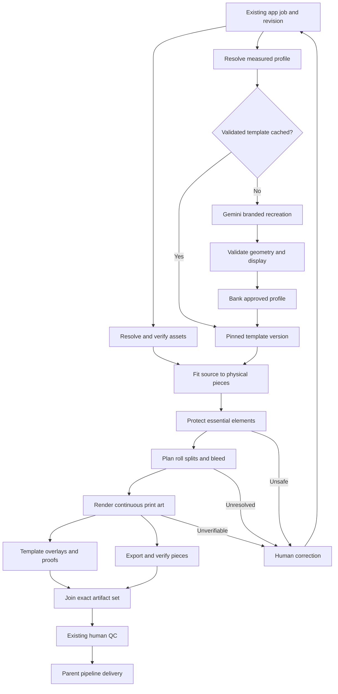

# PanelProFileOutput: shared deterministic output graph

Updated: 9 September 2026. Parent workflow: [DesignProAI OS](DESIGNPROAI-END-TO-END.md).

**Upstream incident:** Harvest Moon Coffee (`DID-E9BABE2D`) has no accepted ATLAS
because its native provider response was only partly saved. PanelProFileOutput
must remain blocked for that request. See the [persistence repair and live
acceptance ledger](ATLAS-PROVIDER-RESPONSE-INCIDENT-20260909.md). Existing IDs and
history remain; no missing panels or approved files are fabricated.

**Parent repair deployed:** [PR #341](https://github.com/Tdill1980/designproai-os/pull/341)
is installed as server `27c0e2c6538b7d17b6a39a4446f5ebe18d3c8bdf` and
`design-panel-ai-generate` v92. Exact-main CI and server acceptance passed,
and all 14 deployed Edge source files match the tested code. Read-only inspection
proved that the original 12 MiB response prefix does not contain a complete
native image. That failed source stays blocked. Browser control stalled before
a fresh post-release UI generation was submitted; no new ATLAS, child output,
QC approval or WrapBox delivery is claimed by this deployment.

PanelProFileOutput is a new shared application for preparing existing artwork
against measured output profiles. Its shared handoff preserves DesignPro,
RecreatePro, GraphicsPro and WallPro identities. This branch connects the
DesignPro graph to RevisionStudioIQ and PanelProStudio; other source apps enter
through reviewed registration until their own job adapters are installed and
accepted. The existing A.T.L.A.S. authoring path remains intact.

The existing OS already saves design/version history. This app reuses that
history and its GenerationID, DesignID, OrderID and revision references. Its
node ledger tracks execution and its template versions track measured profiles;
neither creates a parallel customer design-history system.

This is the implementation contract and acceptance ledger. Code capability,
installed graph, tested provider integration, real-template validation and human
QC are recorded separately. No `[x]` below means a live deployment or automatic
production approval unless it explicitly says so.

Initial deployment record: [PR #335](https://github.com/Tdill1980/designproai-os/pull/335)
is merged at `main` commit `0af5329eac1873dfccf84ba37b09314ec3ffefd8`. All five
new migrations are applied under their canonical versions with installed SQL
hashes verified; image-generation Edge version 91 was active at that release and
all 14 source files matched. It is superseded by the v92 parent repair above.
[Server deployment 34316492947](https://github.com/Tdill1980/designproai-os/actions/runs/34316492947)
passed at 05:54 UTC on 9 September for that exact commit, including both workers
and the gateway. The public studio bundle includes the new application route.
The new service activation flags remain default-off; this does not establish an
enabled, accepted PanelProFileOutput trial. See the
[parent deployment status](DESIGNPROAI-END-TO-END.md#deployment-status--9-september-2026)
and the open quality blockers below.

The parent progress recovery subsequently deployed in
[PR #339](https://github.com/Tdill1980/designproai-os/pull/339), exact server
commit `d6a82db1e33d7922bc363cbcb4de514a8370b17d`.
[Deployment 34319222749](https://github.com/Tdill1980/designproai-os/actions/runs/34319222749)
passed at 06:32 UTC and the public application bundle changed. This repairs
read-only progress recovery; it does not enable the child flags or approve a
physical output trial.

Call 1 identity repair [PR #340](https://github.com/Tdill1980/designproai-os/pull/340)
is merged at `7eb2fb9eb943e91fd659f5d796f36f2bf096807c`. Production migration
`20260909062205` is installed, bringing the canonical chain to 97. Its SQL hash,
permissions, identity guards and unchanged 56-row ATLAS history are verified.
The matching [server deployment 34322868929](https://github.com/Tdill1980/designproai-os/actions/runs/34322868929)
passed at 07:18 UTC after exact merged-main CI. Both runtime replicas, gateway
and shared spool passed; successful new claim-RPC polls and the public
`index-BOeIciMl.js` bundle were observed after cutover. This repair carries
separate artwork and manufacturing revision IDs into this app's existing
handoff contract. The child activation flags and real-template trial remain open.

## 1. What this app produces

For a validated profile and revision, the app produces a repeatable physical-piece
plan, actual artwork placement, branded template preview, template/art overlay,
installation-cut review, before/after protected-element placement, bleed preview,
dimensioned production proof and output artifacts with a verification manifest.

The printed rectangle stays filled with existing nonessential design/background
through wheel openings, windows, handles, seams and other areas cut during
installation. Protected content stays outside those areas with explicit
clearance. The mask is an inspection overlay; it never punches holes into print
art. If the available source cannot cover an area correctly, stop for correction
instead of adding transparency, a blank patch or invented filler.

Solid black or another color already present as the intended background is valid
nonessential artwork. The renderer must distinguish that design choice from an
empty area or placeholder; it must not reject a legitimate solid-color design.

## 2. Separate application graph



A correction creates a new revision or input version and reruns affected
descendants. It does not erase the earlier review. Template-cache hits skip
generation only when the exact body/profile, geometry, display and review hashes
match. A cached approximate vehicle silhouette is not a usable measured profile.
The correction arrow denotes a new revision/run; it is not a cycle inside the
persisted dependency graph.

RevisionStudio already maps design edits to regenerated panels. Preserve that
existing revision flow. A PanelProFileOutput change to visible artwork returns
through the same edit mapping, which produces the matching panels and proofs;
the new child does not overwrite the accepted ATLAS or invent a second revision
system. Existing IDs and history remain connected, and the changed descendant
artifact set requires fresh QC.

## 3. Shared intake and app adapters

| Source | Required inherited identity | Geometry and assets | Return destination |
|---|---|---|---|
| DesignPro | Existing generation, design, revision, order when assigned | Six canonical ATLAS sources, GENIE manifest, vehicle body profile, reusable assets | RevisionStudioIQ, PanelProStudio, GENIE and existing delivery graph |
| RecreatePro | Existing recreation job/design and revision | Verified reconstructed/layered artwork and measured output profile | RecreatePro source job plus shared output-preparation review |
| GraphicsPro | Existing graphics job/design and revision | Original vectors/raster assets, protected lettering/logos, actual output surface | GraphicsPro source job plus shared output-preparation review |
| WallPro | Existing wall job/design and revision | Measured wall extents/openings, source artwork and product-specific print policy | WallPro source job plus shared output-preparation review |

The wrap rule of 5-inch outside bleed and the initial vehicle-template fixture
are explicit policies. Do not silently impose vehicle cuts, dimensions or policy
on walls or unrelated graphics. Every adapter resolves ownership and approved
assets server-side. The browser may identify an existing job, but cannot assert
that arbitrary geometry or artwork is already reviewed.

The baseline handoff builder is
`runtime/panelpro-file-output-contract.cjs::buildPanelProFileOutputHandoff()`.
It accepts all four source names; accepting a name is not proof that its app's
real job resolver is installed. The adapter acceptance matrix at the end records
that distinction.

The shared application routes are `/panelpro-file-output`,
`/panelpro-file-output/runs/:runId`, the internal preparation route
`/panelpro-file-output/prepare` and the internal template review route
`/panelpro-file-output/templates`. Page code is
`app/src/pages/PanelProFileOutput.tsx`; `PanelOutputRunView` shows the persisted
run and `PanelProFileOutputPreparation` supplies the internal preparation flow.
`app/src/lib/panelpro-file-output-api.ts` exposes `panelOutputApi`.

The two internal preparation routes use
`app/src/components/RequirePanelOutputReviewer.tsx`. Its capabilities request
checks the existing `designpro_qc_members.can_preflight` permission, matching
server preparation/review writes. An authorized designer does not also need an
unrelated admin role to open these new pages. An unavailable permission check
shows a retry state and cannot grant access or approval.

| HTTP interface | Purpose | Required authority |
|---|---|---|
| `GET /api/panelpro-file-output/capabilities` | Return the authenticated account's preparation/review capability and scheduling flag | Authenticated session; server derives capabilities from existing QC membership |
| `GET /api/panelpro-file-output/runs` | List runs, filtered by inherited identity | Authenticated owner scope or authorized staff reviewing an identified job |
| `POST /api/panelpro-file-output/runs` | Create/resume from an already registered source identity | Authenticated owner or authorized staff; server resolves stored handoff |
| `GET /api/panelpro-file-output/runs/:runId` | Project current nodes, pieces, eligible previews and blockers | Owner or authorized internal reviewer |
| `POST /api/panelpro-file-output/sources` | Register the verified source/profile handoff | Internal authorized preparation; request body is not a proof of review |
| `POST /api/panelpro-file-output/runs/:runId/approve` | Approve the exact child preparation artifact set | Authorized internal QC member, current artifact-set hash, explicit checks and approval reference |
| `POST /api/panelpro-file-output/runs/:runId/resume` | Retry a failed run whose failed nodes are eligible transient failures or exhausted leases | Owner or authorized internal reviewer; successful ancestors and immutable input remain unchanged; invalid-input failures require a corrected new input |
| `POST /api/panelpro-file-output/production/:productionRunId/reserve` | Reserve optional child preparation before the parent's final verification starts | Internal reviewer; exact parent run and inherited source identity |
| `POST /api/panelpro-file-output/runs/:runId/attach` | Submit the reviewed child for the parent's final production review | Internal reviewer; immutable child approval and matching parent identity |

For DesignPro, `runtime/panelpro-source-binding.cjs::verifyDesignProPieceSources()`
admits an exact canonical Call-1 panel or its exact verified Call-12 enhanced
derivative. The enhanced path joins the same owner, workflow revision, production
GENIE manifest, immutable artifact and `call12.topaz-upscale` receipt. Its
`sourcePanelHash` and `brandedPanelHash` must both identify the original canonical
panel; a previously human-corrected different source is refused. The renderer
then measures effective full-size PPI independently, and human QC checks native
detail. A larger bitmap or a changed DPI label cannot satisfy those checks by
itself. Manufacturing-run ID, GenerationID and ATLAS revision ID remain distinct.

The same module's `verifyDesignProTemplateVehicle()` compares the existing
revision's make, model and year with the measured geometry, then checks known
body, wheelbase, roof, cab, bed, subtype and trim fields. It normalizes spelling
aliases without guessing physical units. A mismatch or missing template variant
is refused. If a legacy source lacks a variant present in the profile, an
authorized operator must supply `templateVehicleReview`, bound to that immutable
revision, geometry hash and GENIE manifest. The server records the actual reviewer;
the review does not modify the saved source or excuse a known mismatch.

These routes use a shared registration boundary. They do not constitute changes
to the external RecreatePro, GraphicsPro or WallPro repositories; real source-job
integrations still require their corresponding acceptance cases.

`runtime/panelpro-file-output-service.cjs::createPanelProFileOutputService()` owns
`registerSource`, `createRun`, `listRuns`, `getRun`, `approve`, `execute` and the
claim loop. Registration requires an internal preflight-QC member, checks private
asset owner paths and bytes, and verifies DesignPro's actual ATLAS revision and
master. Other source apps initially enter through this reviewed registration
boundary. The service uses the stored handoff when a customer requests a run.
For DesignPro customer work, the server resolves the owner from the immutable
source revision while retaining the separate staff actor. Registration returns
`sourceId` and `inputHash`; the UI carries both into run creation so two placements
of the same source revision cannot resolve ambiguously.

## 4. Immutable input contract

| Field group | Required content | Why it is part of identity |
|---|---|---|
| Job | `sourceApp`, `tenantKey`, `sourceJobId`, existing `generationId`, `designId`, `orderId`, workflow `revisionId` and separate `atlasRevisionId` where applicable | Preserves OS history and owner scope; workflow and ATLAS revision IDs are not interchangeable |
| Source | Master and every piece source as storage path plus SHA-256 | Prevents stale URLs and one job's art being reused for another |
| Geometry | `dimensionManifestHash`; template ID/version/profile/geometry hashes | Prevents a correctly drawn overlay on the wrong vehicle variant |
| Display | Generated/branded template reference and explicit review state | Only approved display material appears in customer pages |
| Assets | Existing vector/raster asset ID, bytes hash, kind and separability | Moves an existing logo instead of redrawing it |
| Pieces | Unique piece ID, source surface, full-size dimensions including measured returns, cuts and protected-element bounds | Models variable physical pieces without changing the six-surface ATLAS contract |
| Mapping | Physical source/background coverage bounds and orientation | Establishes where real source pixels land and whether bleed is covered |
| Composition | Verified background, layer-separation and nonessential-content evidence | Moving a loose logo is insufficient if the old logo remains baked into the panel |
| Policy | 5-inch outside bleed, full-size PPI, printable width, clearance, drawing scale and allowed split policy | Same inputs and policy yield the same plan |
| Input digest | Canonical `inputHash` | Durable replay, deduplication, change detection and parent approval binding |

Limits are explicit: up to 128 pieces, up to 64 protected elements and 64 cut
polygons per piece, and bounded polygon complexity. These are resource and
validation limits, not evidence that an input's geometry is correct.

Server intake must bind review evidence to the exact source and profile hashes.
A client-supplied `geometryValidated: true`, `layerSeparationVerified: true` or
`nonessentialCutFillVerified: true` is not an authorization or quality check.

## 5. Node-by-node execution contract

| Node / logical operation | Dependencies and inputs | Code owner / mechanism | Output, validation and recovery |
|---|---|---|---|
| Intake / source resolution | Authenticated source-app job and revision | Owner-scoped app adapter and intake API; handoff builder | Immutable input snapshot; reject tenant or artifact mismatch before enqueue |
| `manifest.resolve` | Exact output/vehicle configuration and measured evidence | Parent GENIE resolver for DesignPro; explicit measured profile for other apps | Physical geometry and dimension hash; unresolved dimensions wait for review |
| `template.lookup` | Geometry identity, body variant, policy | Template registry adapter | Exact compatible bank hit or explicit miss; no guessed template |
| `template.recreate` | Cache miss and privately held reference | `runtime/panelpro-template-provider.cjs::recreateBrandedTemplateCandidate()` with native Interactions adapter | Branded presentation candidate plus provider identity; no manufactured dimensions |
| `template.brand` | Recreation result and original brand asset | Same candidate producer; deterministic brand-header composition | Display-only branding recorded in immutable artifact; original reference remains private |
| `template.validate` | Candidate display and measured geometry | `approveAndBankTemplateCandidate()` plus authorized explicit display-region review | Anchors, scale, orientation, panel boundaries, cut areas and display checked against exact profile |
| `template.bank` | Completed validation | `approveAndBankTemplateCandidate()` and versioned template registry | Bank a reusable version; later changes produce a new version and invalidate affected descendants |
| `source.verify` | Existing approved artwork and asset inventory | Source adapter and byte verification | Source/asset bytes match hashes; source geometry and resolution metadata verified |
| `panelprofileoutput.fit` | Verified source plus checked template | `runtime/panelpro-file-output-plan.cjs::buildPanelProFileOutputPlan()` and mapping validator | Explicit physical coordinates and candidate placements; no implicit passenger mirroring or fit-to-box distortion |
| `panelprofileoutput.protect` | Fit plan, cut polygons, protected bounds, clearance | Planner polygon intersection and bounded translation search | Preserve lettering/identity/size/orientation; final arrangement rechecked; unresolved conflicts request correction |
| Split planning | Protected placement plus printable width and installer-reviewed seam policy | Physical-piece planning extension | Stable child IDs, source rectangles, seam position, overlap and feed rotation; split crossing essential content needs correction |
| `panelprofileoutput.bleed` | Safe placement and split geometry | Coverage validator and renderer | 5 inches each outside edge filled by verified existing artwork; overlap and returns remain separate dimensions |
| Render print pieces | Verified mappings, sources, assets and coverage | Deterministic raster/vector composition producer | Actual continuous rectangular pixels; source hashes, transforms and output hashes recorded; no fabricated background |
| `panelprofileoutput.proof` | Rendered pieces, template display and metadata | Deterministic proof/overlay producer | Branded template, overlay, installation-mask review, placement comparison, bleed preview and dimensioned proof |
| Export and verify | Every required rendered piece and print policy | Bounded file-output producer and structural validator | PNG/TIFF and documented PDF derivatives; exact pixel geometry/profile/density; preserve parent canonical EPS contract |
| Artifact-set join | Every planned output and required preview exists | Graph completion validator | Completeness manifest containing every piece/format/hash; blocked piece means run is not complete |
| `await_panelpro_preflight_qc` | Verified source and preparation proof | Existing authorized PanelPro human gate | Human approves exact revision/input hash; automatic preparation cannot impersonate this decision |
| Parent completion | Existing final QC, stamping and delivery dependencies | Existing DesignPro production graph or explicit source-app delivery adapter | Outputs reach correct pages and final package; new app does not independently mark customer delivery complete |

`panelProFileOutputGraph()` in the baseline contract declares the template and
fit/protection/bleed/proof dependency fragment. A declaration is not a running
worker. Each installed stage needs a callable producer, durable claim, heartbeat,
completion receipt and recoverable output. Do not enqueue placeholder nodes that
return success without their artifacts.

The actual per-job compiler is
`runtime/panelpro-file-output-graph.cjs::compilePanelProFileOutputGraph()` with
definition `designpro.panelpro-file-output-graph.v1`. It consumes a previously
reviewed template-bank entry. Template recreation/validation/banking is a separate
input lifecycle; the per-job compiler does not claim to generate a template on a
miss. Its persisted node topology is:

| Actual node | `dependsOn` | Work |
|---|---|---|
| `source.verify` | Empty root | Verify the immutable registered source |
| `template.lookup` | Empty root | Resolve the exact reviewed bank version |
| `panelprofileoutput.plan` | Source and template roots | Compute and preflight deterministic geometry/protection |
| `panelprofileoutput.render:<pieceId>` | Plan | Render one independently recoverable physical piece and sections under the shared heavy-work permit |
| `panelprofileoutput.verify` | Every piece-render node | `verifyPieceArtifactJoin()` checks pieces, section formats, input digest and duplicate artifact paths |
| `await_panelpro_preflight_qc` | Verified artifact join | Wait for a real internal reviewer |
| `panelprofileoutput.package` | Exact reviewed set | Package the reviewed child outputs |
| `panelprofileoutput.handoff` | Package | Return the child receipt/artifacts to its existing source workspace |

`validateGraph()` rejects missing dependencies, duplicate keys and cycles.
`readyNodes()` treats only completed parents as satisfying dependencies.
`publicNode()` emits fixed public narration from stored node state.

`runtime/panelpro-file-output-service.cjs::createPanelProFileOutputService()`
executes those nodes. `registerSource()` verifies and stores the handoff;
`createRun()` installs its compiled graph; `listRuns()` and `getRun()` enforce
read scope; `approve()` and `resume()` invoke the guarded database transitions.
`tick()` claims one node, heartbeats the lease every 30 seconds, obtains the shared
heavy permit for planning/rendering/verification/packaging, calls `execute()` and
commits output plus artifact receipts under the current token. Capacity deferral
returns the consumed attempt. `stop()` aborts active work; `health()` reports the
actual worker contract, enabled state and recorded error code.

`runtime/index.js` starts/stops this service and exposes the authenticated internal
`/internal/panelpro-file-output/:action` boundary. `gateway/src/server.mjs` owns
the browser-facing routes and injects the verified actor. Scheduling requires
`DESIGNPRO_PANELPROFILEOUTPUT_ENABLED=true`; the default is disabled until the
matching schema, service package and reviewed input data are installed.

The migration is
`supabase/migrations/20260908190825_panelpro_file_output_graph.sql`.
It creates the separate application ledger rather than changing ATLAS surface
keys or canonical artifact counts:

| Database object | Responsibility |
|---|---|
| `panelprofile_source_handoffs` | Immutable owner/source-app/job/revision input registration and digest |
| `panelprofile_template_bank` | Immutable reviewed template version, geometry/profile hashes and branded display |
| `panelprofile_runs` | Definition version, source identity, state and verified artifact-set hash |
| `panelprofile_nodes` | Dependencies, attempts, readiness time, lease, output and completion hash |
| `panelprofile_artifacts` | Immutable run/node/piece/role storage identity and bytes evidence |
| `panelprofile_events` | Persisted node-state changes for progress |
| `create_panelprofile_run` | Idempotent graph installation, including independent SQL dependency/cycle validation |
| `claim_panelprofile_node`, `heartbeat_panelprofile_node`, `finish_panelprofile_node` | Lease-fenced claims, retries, result and artifact commit |
| `approve_panelprofile_output` | Authorized QC member, confirmed identity, exact artifact set and explicit checklist |
| `resume_panelprofile_run`, `defer_panelprofile_node` | Explicit retry of eligible failed work, or capacity deferral without consuming an attempt; neither changes the immutable input |
| `acquire_panelprofile_heavy_lease`, `panelprofile_sync_heavy_lease` | Share and maintain the existing production raster-memory slot |

RLS is enabled and direct browser table/RPC access is revoked. The authenticated
runtime owns intake/read authorization; internal RPCs do not accept a browser's
claim that it is an approved operator. Sources, templates, artifacts and events reject
mutation. Migration existence in the repository is not evidence that these
objects have been installed on a database.

The byte-backed renderer is
`runtime/panelpro-file-output-render.cjs`. Its exported entry points are
`preparePanelProFileOutput()`, `renderPanelProFileOutput()` and
`renderPanelProFileOutputPiece()`. Preparation reads and hashes source, geometry
and display bytes, measures effective pixel density and verifies mappings. The
actual print source must be opaque. An explicit verified layer rebuild may
replace a legacy source's transparent areas using its existing background and
separated assets. Rendering composes those assets, produces each section and
checks real output metadata before recording artifacts. A successful renderer
reports `productionFilesCreated: true`, `qcApproved: false` and
`releaseToCustomer: false`.

| Renderer output | Role / content | Approval meaning |
|---|---|---|
| Lossless PNG | `production-png`; continuous RGB art with explicit 1:10 drawing density, full-size dimensions, profile and `_TENTH_SCALE.png` filename | Prepared, pending human QC |
| LZW TIFF | `production-tiff`; same pixels, 1:10 drawing density and color profile; `_TENTH_SCALE.tiff` filename | Prepared, pending human QC |
| PDF | `production-pdf`; 1:10 drawing, embedded lossless image/profile, trim and bleed boxes; `_TENTH_SCALE.pdf` filename, `1:10` metadata and 1000% print instruction | Prepared, pending human QC; this is raster artwork in a PDF |
| QC copy | `qc-panel-copy`; duplicated inspection file labeled nonprinting | Does not replace the source or certify background separation |
| Six preview roles | Branded template, overlay, installation mask, comparison, bleed and production-panel proof | Display approval only; not production QC approval |
| Piece receipt | Input/profile/geometry/source/output hashes, transforms, sections, resolution evidence | Machine verification of recorded checks; native detail remains human-reviewed |

Logical artifact names are `production/<pieceId>/<sectionId>_TENTH_SCALE.png`, `.tiff` and
`production/<pieceId>/<sectionId>_TENTH_SCALE.pdf`;
`review/<pieceId>/<sectionId>-qc-copy.png`;
`previews/<pieceId>/<role>.png`; and
`assets/<assetId>/<contentHash>.<extension>`. Storage adds the immutable content
hash and owner/run prefix. Download URLs remain temporary access, not identity.

All three formats retain full-size pixel detail while recording a 1:10 drawing
scale. At 150 full-size PPI, the raster density is 1500 DPI; the RIP must enlarge
the drawing to 1000% to reach its stated full-size dimensions. The manifest
records both physical dimensions and pixel dimensions. All three production
filenames carry `TENTH_SCALE`; the PDF's internal title also says `TENTH SCALE`.
Human output inspection checks the
RIP's final physical size, rather than treating a DPI tag as proof of correct
scale or native image detail.

After the exact child artifact set receives all eight human checks,
`panelprofileoutput.package` creates a separate `qc-approved-panel-proof`
derivative for every prepared panel proof. `stampSvg()` and
`renderStampedProof()` bind it to the source-proof hash, child artifact-set hash,
reviewer, approval reference and recorded approval time. Original print pixels
and unstamped review proofs remain unchanged. The deterministic child ZIP then
includes production files, review previews, those approved proof derivatives,
QC copies, reusable assets and their manifest. Child QC still does not grant
customer release; the parent must approve and deliver its complete set.

The initial renderer exports sRGB. It does not claim a printer-specific CMYK
conversion. It accepts self-contained SVG assets; unsupported PDF/EPS vectors
need a verified supported derivative. The parent pipeline retains its existing
canonical EPS output contract. A vector original is preserved as an asset even
when the composed print output is raster.

### Optional connection to the parent production package

`runtime/panelpro-production-attachment.cjs` connects a reviewed DesignPro child
to the existing production graph. Migration
`20260908195123_designpro_panelprofile_production_attachment.sql` stores that
connection without changing the six canonical surfaces or their 18-file verifier.

| Boundary | Code / database mechanism | Required evidence |
|---|---|---|
| Reserve the parent | `reservePanelProfileForProduction()` → `reserve_panelprofile_for_production`; `designpro_panelprofile_reservations` | Explicit authorized operator, exact parent/source, before `output.verify` starts |
| Attach a reviewed child | `attachPanelProfileToProduction()` → `attach_panelprofile_to_production`; `designpro_panelprofile_attachments` | Completed child, all eight QC checks, exact owner/revision/master/GENIE identity, byte-verified complete artifact inventory |
| Freeze the join | `loadPanelProfileAttachments()`; `designpro_private.assert_panelprofile_attachment_join()` | At most one immutable snapshot, exact child approval and file hashes; reserved-but-absent child cannot pass |
| Defer a reserved wait | `defer_designpro_for_panelprofile(stageId, leaseToken)` | Active production `output.verify` lease; 30-second retry and returned attempt budget |
| Retain approval identity | `assertPinnedPanelProfileAttachments()` | `output.verified.panelProfileAttachments` equals the immutable database projection throughout stamping and delivery |
| Add files to the ZIP | `attachmentArchiveFiles()` and the existing ZIP/WrapBox producers | Safe unique `panelprofile/<childRunId>/...` names; original child paths, hashes, byte sizes and approval remain in the manifest |

The pinned projection is an array containing
`{ attachmentId, childRunId, snapshotHash, snapshot }`, or an empty array for a
run without a child. The later SQL migration extends
`assert_final_proof_join(uuid, jsonb)` in place; the seven-view and Call 8 gates
still execute. Reservation is optional and does not change unrelated orders.

A moved protected element or a composition rebuilt from separated assets changes
the visible design even when every geometry check passes. Such a child reports
`requiresProofRefresh` and cannot attach to stale parent proofs. It must return
through the existing RevisionStudio revision mapping, obtain a newly accepted
source and matching proofs, and undergo the corresponding QC. No-move layer
rebuilding also requires that refresh; movement count alone is insufficient.
`revisionContinuation()` returns the existing RevisionStudio route with the
exact GenerationID, ATLAS revision ID and child-run ID. It carries the saved
proposal for review with `autoApply: false`. The geometry result cannot silently
replace the accepted design or its proofs.

## 6. Deterministic geometry and essential-content protection

The planning coordinate system is full-size inches. Each piece's dimensions
already include measured returns. Outside bleed, seam overlap and material-feed
rotation are recorded separately. Canvas enlargement alone creates no useful
bleed pixels.

| Rule | Calculation / behavior |
|---|---|
| Outside bleed | `printWidth = trimWidth + 10`; `printHeight = trimHeight + 10` |
| Example hood | 64 × 53 inch trim becomes 74 × 63 inches including outside bleed |
| Roll fit | A 59.5 inch printable width cannot take that hood in either 0° or 90° feed orientation; a checked split is required |
| Full-size resolution | At 150 PPI, a 110 × 50 inch output needs 16,500 × 7,500 pixels |
| Drawing scale | A 1:10 drawing uses 1500 drawing PPI for the same 150 full-size PPI detail |
| Existing raster detail | Compare real source pixels with mapped full-size dimensions; changing a DPI tag or upsampling is not proof of detail |
| Asset translation | Preserve dimensions, rotation, mirroring state, lettering and source hash; record before/after physical bounds |
| Cut safety | Protected bounds plus policy clearance must avoid cut polygons, outside trim and conflicting protected content |
| Background continuity | Every required print pixel, including areas later cut away and bleed, is covered with verified nonessential artwork |

The supplied Nate printing transcript gives the following concrete preparation
requirements. Its measurements are examples, so the profile stores reviewed
measurements for the actual vehicle rather than copying those numbers.

| Tutorial operation | Deterministic implementation requirement |
|---|---|
| Bound Driver and Passenger | Use the painted body's extremal bounds; exclude wheel height and separately planned bumpers |
| Measure trunk return | Add the verified vertical return from an adjacent view or physical measurement before outside bleed |
| Measure bumper returns | Add independently verified left and right wraparound extents; do not infer symmetry from a bitmap |
| Duplicate top artwork | Reuse the same existing asset where the reviewed layout calls for it, with separately recorded Hood/Roof/Trunk crops; never consume or redraw an asset merely because another piece uses it |
| Remove template/mask from print | Render only artwork into each production rectangle; retain template lines and cut-mask visualization in review artifacts |
| Fill uncovered edges | Extend only a verified existing nonessential background, including a legitimate solid black region; otherwise request correction |
| Make one artboard per piece | Preserve separate physical IDs and exact dimensions; seven example print pieces plus one overall proof remain distinct sets |
| Export individual PDFs | One PDF per physical section; the overall proof is a review artifact, excluded from the production-panel selection |
| Identify scale | A 1:10 derivative needs an explicit `TENTH SCALE` filename indication as well as scale metadata and proof labeling |

`widthInches` and `heightInches` in the handoff already include those measured
returns; the contract adds 10 inches to each dimension for 5-inch outside bleed.
It does not estimate return depth from a generated view. The six ATLAS surface
keys stay intact: a trunk or another extra physical piece must declare its exact
approved source mapping rather than introducing an implicit seventh surface.
Do not apply the tutorial's 3-inch bleed or round a measured extent down.

The current planner uses edge intersections and containment, rejects degenerate
or self-crossing cut polygons, and searches a bounded set of candidate translations
around obstacle edges. It rechecks all final placements. “No safe candidate found”
means this automatic method needs human correction; it is not a mathematical proof
that no design can fit.

When splitting is necessary, the planner requires an installer-reviewed axis and
overlap policy, creates stable section IDs, and treats overlap seams as additional
protected-content obstacles. Every exported section retains 5-inch outside bleed.
The renderer rejects dimensions that cannot map to an exact integer pixel grid
at the configured full-size PPI rather than silently changing physical size.

An element may move only when the asset is separable and the composition's clean
background/layer separation is verified. A stored logo asset beside a flattened
image is not enough. Otherwise movement could leave the old logo visible while
placing a duplicate elsewhere. The background itself must also be suitable to
fill all installation cuts with nonessential design.

`composition.rebuildFromSeparatedAssets: true` is the explicit deterministic
repair path for a legacy flattened source containing a transparent cut. It
requires the same verified opaque, nonessential background and separated assets
as a relocation. The old pixels remain in history; newly rendered print pieces
are filled by the approved background, without a new image-generation request.

No automatic re-authoring occurs in this app's deterministic branch. If a human
or a separately authorized image-edit branch repairs the artwork, it returns a
new hashed source revision and passes the same fit/content/output checks. The
existing canonical source remains in history.

## 7. Template recreation and the growing bank

1. Resolve the exact source template and vehicle configuration. Make/model/year
   labeling helps lookup, but body, wheelbase, cab, bed, roof and trim variations
   can change the usable geometry.
2. Preserve the private vector reference and measured anchors. Normalize its
   units and drawing scale into the app's full-size coordinate system.
3. Reuse a validated bank entry when all identity and review hashes match.
4. On a miss, send the appropriate display reference to the separate Gemini
   adapter to create the branded presentation. Do not use its generated pixels
   as replacement manufacturing measurements.
5. Check registration, orientation, anchors and cuts against the measured
   profile. The initial internal team verifies new body profiles before banking.
6. Store geometry, display, review, source and policy versions together. Customer
   previews use the approved branded display and deterministic artwork overlay.
7. Bank the accepted profile for subsequent jobs. A rejected recreation remains
   an internal candidate and does not appear as an approved customer template.

`runtime/panelpro-template-provider.cjs` implements that separate lifecycle.
The reviewed vehicle input is `designpro.vehicle-template-geometry.v1`, with
`units: "in"`, specific make/model/year/body style, piece outlines and installation
cuts. It reads the source geometry, a reviewed raster display reference and the
original brand asset by hash. Gemini Pro produces display line art; code adds the
exact original brand in a separate header. The result is a private
`requires_geometry_overlay_review` candidate, never an approved customer preview.

The reviewer supplies per-piece `displayRegionPixels` after checking the recreated
display against the unchanged physical geometry. Approval binds that review to
the exact display/source-geometry hashes. The output geometry contract is
`designpro.panelpro-file-output-geometry.v1`, compatible with the deterministic
renderer. It carries the unchanged inch dimensions, outlines and cuts plus new
display registration and review provenance. A valid bank hit verifies those
identities and makes zero new image-model requests.

`app/src/pages/PanelProTemplateReview.tsx` provides the internal import,
candidate, measured-overlay review and bank interface. Source checks start
unchecked. Display approval uses one explicit pixel region per measured piece
and resets when the candidate or geometry identity changes. A downloaded bank
descriptor points to the approved artifacts; downloading it does not perform
another generation or approve a print job.

`runtime/panelpro-template-service.cjs::createPanelproTemplateService()` makes
this lifecycle durable. Its contract is `designpro.panelpro-template-service.v1`.
`importSource()` requires the original vector, reviewed raster, original brand,
measured geometry, exact body variant, physical measurement reference and fit
tolerance. `createCandidate()` accepts a stored `sourceId`; it cannot replace
that evidence with fresh browser flags. `runNext()` leases the job and persists
the provider result. `approveCandidate()` banks only the exact reviewed result;
`recoverCandidate()` retrieves cached evidence without another paid image request.

| Template API | Operation |
|---|---|
| `POST /api/panelpro-file-output/templates/sources` | Import the measured, reviewed source and immutable references |
| `GET/POST /api/panelpro-file-output/templates/candidates` | List authorized candidates or create from a stored source ID |
| `GET /api/panelpro-file-output/templates/candidates/:candidateId` | Read the private candidate and its actual state |
| `POST /api/panelpro-file-output/templates/candidates/:candidateId/review` | Submit exact display regions and hash-bound human review |
| `POST /api/panelpro-file-output/templates/candidates/:candidateId/recover` | Resume retrieval of the same recorded provider attempt |

The gateway injects the authenticated actor into
`/internal/panelpro-templates/:action`; the runtime repeats the QC-membership
check. Candidate imagery remains private. Migration
`20260908194544_panelpro_template_lifecycle.sql` adds these records:

| Persisted object | Purpose |
|---|---|
| `panelprofile_template_sources` | Immutable measured import and source review |
| `panelprofile_template_candidates` | Leased durable candidate job; one identity per source |
| `panelprofile_template_bank_evidence` | Exact source/candidate/display review linked to the existing bank |
| `panelprofile_template_events` | Recorded lifecycle transitions |
| `register_panelprofile_template_source`, `create_panelprofile_template_candidate` | Authorized source registration and idempotent candidate creation |
| `claim_panelprofile_template_candidate`, `heartbeat_panelprofile_template_candidate`, `finish_panelprofile_template_candidate` | Fenced background execution and completion |
| `approve_panelprofile_template_candidate`, `recover_panelprofile_template_candidate` | Human-bound banking and cache-only recovery |

These tables and RPCs are restricted to the service role. The runtime exposes
start, stop and health status. `DESIGNPRO_PANELPROFILE_TEMPLATE_RECREATE_ENABLED`
defaults to `false` and is separate from `DESIGNPRO_PANELPROFILEOUTPUT_ENABLED`.

PDF/EPS source templates require a reviewed raster display derivative. Import
preserves the original vector but does not infer measured dimensions from its
bitmap preview. The brand
may use a self-contained SVG. Wall and other output profiles need their own
reviewed source geometry; the vehicle-specific recreation helper must not apply
vehicle dimensions to those jobs.

The supplied printing tutorial and body-parts diagram establish process and
coverage expectations. They are not calibration files. The actual Dropbox vector
library must be connected/imported and a representative profile reviewed before
real vehicle-fit acceptance. This is a concrete data dependency, not a reason to
invent approximate manufacturing geometry.

The supplied [one-panel installation walkthrough](https://docs.google.com/document/d/1kFOmNccJFm87PayqS82vBSLPZNTdo7HFp5hJ_zCi5iA/edit?usp=drivesdk)
reinforces the same contract. Keep a continuous side in one horizontal print
when its measured print extent fits the configured roll and installation policy;
this avoids unnecessary registration seams. A whole-panel shift that aligns a
pattern with another surface can push a logo into a light or edge, so alignment
and protected-element clearance must be checked together. Its wrong-vehicle
example is a reason to reject a make/model/body mismatch. Its demonstrated
54-inch roll and approximate six-inch surplus are examples, not replacements for
this job's configured roll and required five-inch bleed. Ink profile, material
stretch and installation technique still require the team's physical trial.

Gemini is used for visual recreation, with its integration governed by the
[parent document's Gemini protocol contract](DESIGNPROAI-END-TO-END.md#7-gemini-3-pro-image-integration).
The deterministic geometry engine and human review remain responsible for
physical fit. Branding a display does not validate its dimensions.

## 8. Progress and studio presentation

| Real event | Customer explanation | Artifact shown after commit |
|---|---|---|
| Template profile accepted | Preparing your template | Approved branded template |
| Placement rendered | Placing your artwork on the template | Actual source artwork overlay |
| Cut-area review complete | Checking important details near installation cuts | Review mask over continuous artwork |
| Deterministic movement rendered | Adjusting important details for the fitted panels | Before/after placement comparison |
| Bleed verified | Preparing the extra material around each panel | Actual bleed boundary and coverage |
| Piece export verified | Creating your production panels | Real piece thumbnail and dimensions |
| Human gate waiting | Ready for the design team's review | Exact submitted proof and output set |
| Parent delivery complete | Your files are available | Verified WrapBox package |

Keep RevisionStudio's panel column beside its 3D proofs. Keep PanelProStudio's
existing proof/panel review and correction controls. The new page supplements
those applications and links back using the existing IDs. Revisions, changed
templates and retries cannot cause thumbnails from another version to appear
beside a current proof.

The child application's QC form is separate from the canonical six-surface gate.
It appears only for permitted reviewers, supplies actual file downloads and starts
every check unchecked: template, fit, essential artwork safety, continuous
background, 5-inch bleed, resolution, physical pieces and inspected files. An
approval reference and current artifact-set hash are required. Changing the hash
resets the checks. Child preparation approval still requires the parent output
and delivery gates before customer release.

The internal preparation page can reserve a selected parent using **Wait for
PanelProFileOutput**. This must occur before parent `output.verify` starts.
The optional wait prevents final approval racing ahead while Call 12's verified
high-resolution source is prepared in the child. **Include with production
review** then submits the completed, reviewed child for immutable attachment.
No other order is reserved implicitly. A moved or rebuilt composition requires
an accepted revision with matching proofs before attachment; a child's passing
geometry result cannot approve stale parent presentation proofs.

`app/src/lib/designpro-workflow-presentation.mjs` recognizes the branded-template,
template-overlay, installation-mask, placement-comparison and bleed-preview roles.
It requires approved branded/validated provenance and signed access. Producer
implementation details, original private reference templates and Gemini thought
data are not public progress content.

## 9. Recovery and latency contract

| Boundary | Required execution behavior |
|---|---|
| Intake | Same owner/source revision/input hash returns or resumes the same run; requests cannot create duplicate paid work |
| Template generation | Persist provider acknowledgment and completed result; reconcile unknown outcomes before retrying |
| Fitting | Pure deterministic plan may be recomputed; preserve the input and output hashes |
| Render/export | Content-addressed outputs plus durable per-piece completion; retry only missing or invalid pieces |
| Long work | Leases and heartbeats; cancel on lost claim; stale attempts cannot publish completion |
| Correction | New source/profile/input version invalidates dependent artifacts and QC; historical artifacts stay readable |
| Parent join | Child run completion attests exact artifacts, not just a boolean; parent checks the same revision and input digest |
| Memory | Explicit bounded raster and transfer permits; spool large outputs, stream uploads and ZIPs |

Source verification and template lookup are independent graph roots. Template
recreation is a separate lifecycle that may run while the source design is being
created; the child job waits for a reviewed bank entry. Once both roots finish,
the child fits and protects the artwork. Each physical piece has a recoverable
render node, while the shared heavy-work slot currently serializes large rasters.
The renderer makes its previews from the same frozen placement as its files.
Further render/upload overlap needs measured capacity; it is not claimed merely
because multiple nodes exist. Every required branch joins before approval or
customer release.

Measure template hit rate, provider latency/retry count, time to first correct
panel, time to complete output set, peak RSS, upload time and correction reasons.
Use those measurements to raise safe limits. The 6 GB production host is a shared
resource; graph concurrency is not a license for unbounded large rasters.

The renderer's hard bounds are 240 million decoded pixels per source/section,
50,000 pixels on an edge and 256 MiB compressed source bytes; geometry and display
have lower dedicated limits. Trusted server settings may lower these bounds;
intake JSON cannot raise them. It processes sections/formats sequentially with
disk spooling. The installed worker must also acquire the existing fleet-wide
heavy-stage lease so two jobs do not consume the host's raster budget together.
The request also has a 16,384-point geometry budget, a two-million edge-check
search budget per piece, and one output-pixel margin beyond the requested
protected clearance to account for raster placement. Exhausting a limit produces
an explicit correction/resource outcome; it never relaxes the content checks.

The handoff receipt reports `requiresProofRefresh` if protected artwork moved or
the visible composition was rebuilt from separated assets.
It reports `customerReleaseApproved: false` even after the child preparation has
passed human QC. A moved design needs matching updated vehicle proofs and parent
approval before delivery; the original ATLAS/proofs cannot be silently presented
as proof of an altered placement.

## 10. Acceptance ledger

### Supplied template source — 9 September 2026

- [x] Read the supplied web archive and open its shared **Vehicle Templates**
  Dropbox folder. Confirm the make/model/year hierarchy by navigating Ford →
  Vans → Transit → 2019. The folder contains labeled AI and EPS source files,
  including `Transit_19_01.ai` and `Transit_19_14.eps`.
- [ ] Select the exact body, wheelbase and roof variant, ingest the source
  bytes, verify vector units/scale and reviewed cut geometry, then run the
  first internal output trial. Folder access and a filename alone do not
  establish measured dimensions or production suitability. The shared-link
  access token is not copied into source code or these markdowns.

The [Call 1 identity audit](DESIGNPROAI-END-TO-END.md#call-1-identity-audit--9-september-2026)
distinguishes a reserved identity from an accepted master/panel set. Child input
must bind the accepted ATLAS revision and exact artwork hashes; a handoff or
snapshot revision ID is a separate identity, not an interchangeable ATLAS ID.
The submit/claim/completion repair, passing exact-head CI, production schema and
matching server installation are recorded in the parent ledger. Fresh model
output and a real-template production trial remain separate acceptance gates.
No child may treat the mere reservation of those IDs as accepted artwork.

The parent studio's temporary-connection recovery repair and its tests are
recorded in [Driver-only display recovery](DESIGNPROAI-END-TO-END.md#driver-only-display-recovery--9-september-2026).
It preserves the existing generation and accepted views. It does not approve a
missing passenger proof, change physical artwork, enable this child service or
resolve the unbound logo-quality report. The separately identified provider
timeout/idempotency work remains an open parent requirement.

### Open output quality blockers — 9 September 2026

The user's passenger-proof delay and serious logo/design-quality degradation
reports are tracked in the
[parent release blockers](DESIGNPROAI-END-TO-END.md#open-release-blockers-reported-on-9-september-2026).
The standalone-database check has no matching current job: its latest generation
request was created on 8 September at 17:40 UTC. No exact GenerationID or failing
physical-output artifact has yet been bound to this report. The child must not
silently compensate for an unexamined authoring or proof defect.

- [ ] Bind a real measured-template trial to the reported design's accepted
  revision and verified original assets. Compare those assets through the
  accepted ATLAS, six panels, seven proofs and resulting physical pieces;
  identify the first altered logo, unreadable text, changed proportion/color,
  composition loss or actual loss of detail. Use original-resolution crops and
  full-size output inspection. A larger raster or changed DPI tag cannot pass
  the sharpness check by itself.
- [ ] Demonstrate deterministic placement with available assets first: original
  logos/lettering remain correctly spelled, proportioned and forward-reading;
  no mirrored text, unapproved reconstruction or stale logo remains after a
  move. Essential elements clear the reviewed cut/trim/seam geometry, while
  continuous existing nonessential artwork fills every installation-cut area
  and the required 5-inch bleed. Inspect PNG/TIFF and required PDF companions;
  retain the parent canonical output contract.
- [ ] Repeat the repaired case through the existing studios, template overlay,
  piece exports and internal human comparison. If a placement changes visible
  artwork, return through the existing ATLAS revision flow and require matching
  refreshed panels/seven proofs and fresh QC. Record measured reproduction,
  regression coverage and reviewed before/after artifacts before checking off
  this blocker. Missing passenger evidence, unchecked files or synthetic QC
  cannot establish successful end-to-end delivery.

Use the existing source-binding, planner, renderer, parent-attachment and
studio-identity suites for the identified failure boundary; their previous
fixture passes are not evidence that this user's report is fixed. Actual
Dropbox templates, other source-app resolvers, automatic-QC policy and pricing
remain outside the completed acceptance ledger.

The reference input builders are `tests/helpers/panelprofile-fixture.mjs` for
measured artwork/placement and `tests/helpers/panelpro-template-fixture.mjs` for
the template lifecycle. They demonstrate the exact contracts with synthetic
geometry. The internal team must substitute reviewed real vehicle/profile and
asset references, rather than use fixture dimensions as a production template.

With Node 22 and the locked runtime dependencies installed, the actual child
service and parent bridge can be exercised independently:

```sh
node --test --test-concurrency=1 tests/panelpro-file-output-db.test.mjs tests/panelpro-file-output-service.test.mjs tests/panelprofile-production-attachment.test.mjs tests/designpro-final-proof-join-db.test.mjs
```

The [parent release gate](DESIGNPROAI-END-TO-END.md#10-ordered-rollout-and-failure-repair)
also runs the renderer, provider, source-binding, UI and packaging suites.

### Shared foundation verified in this branch

- [x] Four-source-app handoff with inherited IDs, immutable paths and input hashing.
- [x] Explicit vehicle-wrap policy: 5-inch bleed, minimum full-size PPI, printable width and protected clearance.
- [x] Protected-element polygon checks, bounded deterministic translations and final recheck.
- [x] Missing separation, unsafe placement and unresolved roll fit return correction requirements.
- [x] GENIE accepts only validated branded preview artifacts and describes actual workflow state.

Supporting baseline tests: `tests/panelpro-file-output-contract.test.mjs`,
`tests/panelpro-file-output-plan.test.mjs`, `tests/workflow-presentation.test.mjs`.
These establish a handoff/planning core, not a deployed production app.

### Renderer verified locally

- [x] Actual PNG/TIFF/PDF and preview output from verified existing assets; repeat rendering is byte-identical.
- [x] Protected logo relocation retains nonessential background in installation cuts and preserves original assets.
- [x] Missing bleed, inadequate effective PPI, wrong geometry/hash and unverified fill stop output creation.
- [x] Explicit 90-degree print-feed rotation preserves artwork orientation without mirroring.
- [x] Reviewed split policy produces overlapping sections with 5-inch bleed and essential-content protection at seams.
- [x] An explicitly verified layer rebuild fills an old transparent cut with existing nonessential background.
- [x] Per-piece work avoids unrelated large source reads; intake/caller limits cannot raise hard resource caps.
- [x] Multi-section splitting distributes integer pixels without changing the physical outer dimensions or declared overlap.
- [x] Legitimate existing solid-black design remains printable through installation cuts and bleed.
- [x] Seven reviewed physical pieces export seven individual scale-labeled PDFs; the separate overall proof never becomes an eighth print panel.

Evidence: focused contract/planner/renderer tests, including real image rendering
in `tests/panelpro-file-output-render.test.mjs`. A generated
PDF decoded with Poppler and its print/proof views were visually inspected.
These are synthetic local fixtures, not measured Dropbox-template or printer trials.

### Durable service and source binding verified locally

- [x] Actual migrated Postgres claims, rendering, verification, eight-check human approval, ZIP64 packaging and child handoff execute together.
- [x] Retry receipts exclude transport-only metadata; unordered artifact rows cannot change ZIP bytes.
- [x] Missing, duplicate, extra or hash/size/MIME-mismatched piece files cannot satisfy the artifact-set join.
- [x] Corrupted artifacts stop with a permanent integrity outcome; temporary reads remain recoverable.
- [x] Source ID and input hash disambiguate different placements of the same revision.
- [x] Colon-containing piece IDs survive storage and ZIP encoding while retaining their original metadata identity.
- [x] Exact canonical or verified Call-12 sources pass admission; wrong owner/revision/manifest or unproved enhancement lineage fails.
- [x] Wrong vehicle/body variants are rejected; a missing legacy variant requires exact source/profile-bound staff review that survives restart.
- [x] Child panel-proof stamps are generated only after its exact artifact set receives all eight human checks, and enter its reviewed ZIP.
- [x] The real optional-child SQL extension retains all seven-view and Call 8 checks through final approval.

Evidence: `tests/panelpro-file-output-service.test.mjs` uses real PGlite,
the actual renderer and ZIP64 code, with storage/TUS transport fixtures.
`tests/panelpro-source-binding.test.mjs` exercises canonical/enhanced admission
and vehicle-identity failures. The full proof/child-migration composition is in
`tests/designpro-final-proof-join-db.test.mjs`;
`tests/panelprofile-production-attachment.test.mjs` exercises reservation,
attachment and downstream propagation. These fixture approvals exercise the
code; they are not approval of any customer design.

### Template provider verified locally

- [x] SHA-verified measured geometry/reference/brand input and separate Pro Image display recreation.
- [x] Exact original-brand composition; generated candidates remain private until review.
- [x] Explicit reviewer-bound display regions preserve source inches, outlines and installation cuts.
- [x] Approved geometry/display banking and matching cache-hit reuse without a new image call.
- [x] Provider-response recovery and invalid/missing review/source cases fail without hidden creative retries.
- [x] Durable measured-source import, candidate lease/recovery, private review and immutable bank evidence execute through real Postgres.

Evidence: provider fixtures in `tests/panelpro-template-provider.test.mjs` and
PGlite lifecycle tests in `tests/panelpro-template-service.test.mjs`.
No actual Dropbox vector, new production template or live Gemini
template call has been accepted by those tests. Internal UI and assembled route
acceptance are recorded separately from these service tests.

### Studio integration verified locally

- [x] Shared run page and protected preparation route render persisted state and eligible previews.
- [x] Internal QC requires explicit checks and a current artifact-set hash; changing that hash resets the form.
- [x] Proof URL, generation/revision/master identity and per-surface camera selection remain distinct, preserving RevisionStudio and PanelPro layout.
- [x] Internal preparation and template routes use the existing server QC capability; capability lookup failure does not grant access.
- [x] The preparation page records an explicit source/profile-bound missing-variant review, and failed runs expose only eligible transient resume.

Evidence: functional rendered/adapter tests, identity tests and a production app
build. Source files include
`app/src/pages/PanelProFileOutput.test.tsx`,
`app/src/lib/studio-panel-source.test.ts` and
`tests/studio-artifact-identity.test.mjs`. Template review and matching route
permissions are exercised by `app/src/pages/PanelProTemplateReview.test.tsx`
and `app/src/components/RequirePanelOutputReviewer.test.tsx`; exact source,
missing-variant review and resume transport are in
`app/src/lib/panelpro-file-output-api.test.ts`. No browser session on the production
server or real source-app job is implied by these local results.

### Assembled branch verified locally

- [x] `node scripts/run-all-tests.mjs` completed successfully with 1,612 passing test executions across source/schema, repository, gateway, web, app and operations groups.
- [x] Both web and operator-app production builds passed; the image-generation Edge entry point also compiled with esbuild.
- [x] The two graph documents have valid repository paths, companion links and Markdown fences.

The [parent validation ledger](DESIGNPROAI-END-TO-END.md#9-fix-ledger-and-release-gates)
records the group counts and remaining boundaries. This combined local gate
includes the new renderer, real-Postgres fixtures, studio adapters and release
inventory. The recorded exact PR-head CI subsequently passed Docker construction,
96 shadow migrations and 289 pgTAP checks. All five new production migrations
and their installed SQL hashes were verified on 9 September. The merged-main CI
and exact server deployment also passed. Internal service activation, live
Gemini, real vehicle templates and actual human QC remain separate acceptance
steps. The broad app TypeScript check still reports 219
errors outside the touched integration files; a successful Vite build does not
make the whole application type-clean.

### Required integration acceptance

| Gate | Pass evidence needed | Status |
|---|---|---|
| Server authority | Owner-scoped resolution rejects cross-tenant sources, stale hashes and client-forged review booleans | Must be verified against installed intake |
| Durable graph | Restart, lost lease, duplicate request, failed upload and partial piece set recover without false completion | Must be verified against installed runner |
| DesignPro adapter | Real ATLAS revision reaches the shared app and returns to its existing studios | Real job acceptance required |
| RecreatePro adapter | Existing recreated job/layers resolve without reminting identities | Real job acceptance required |
| GraphicsPro adapter | Existing asset and output profile resolve through the same contract | Real job acceptance required |
| WallPro adapter | Measured wall/opening profile and explicit policy work without vehicle assumptions | Real job acceptance required |
| Template bank | Actual vector reference and measured anchors create one reviewed reusable bank entry; next job reuses it | Dropbox/profile input required |
| Exact body variant | Existing source vehicle fields and reviewed geometry identify the same body/roof/wheelbase configuration, or require an explicit authorized missing-variant review | Guard and restart tests pass locally; real profile acceptance required |
| Nonessential cut fill | Actual prints remain filled in cut areas; protected content remains clear; no leftover old logo after movement | Layered artwork and pixel/visual checks required |
| Roll splitting | Oversize piece produces measured children with approved overlap and no essential artwork on unsafe seams | Installer-reviewed split fixture required |
| Output | Actual PNG/TIFF and required PDF/canonical EPS companions decode, match geometry and preserve source detail/profile | Real-size output fixture required |
| Human comparison | Internal team compares automated prep with current human output and records every correction | Human trial required |
| Delivery | Approved artifacts join all seven stamped proofs and Call 8 in the correct job's verified ZIP/WrapBox delivery | Parent end-to-end gate required |

### Decision after the trial

- [ ] Complete a representative measured vehicle and layered-design case end to end.
- [ ] Compare the result with the existing human process, including installation cuts and bleed.
- [ ] Repeat on varied body configurations, brand assets and difficult layouts; record failure categories.
- [ ] Define any profile-specific automatic approval policy from observed results.
- [ ] Decide SaaS/output pricing separately from these engineering tests.

The deterministic portion is feasible when geometry, assets and policies are
verified and the artwork can be composed safely. Universal hands-off acceptance
for every flattened design is not established. Inputs without usable geometry,
separable protected content or adequate detail continue through the internal
designer correction path with their evidence intact.
