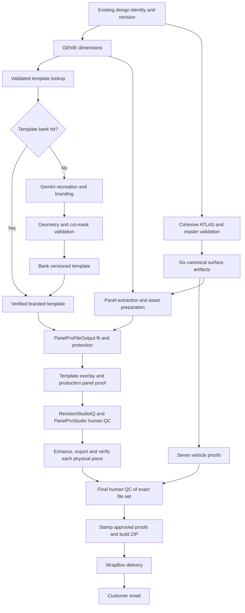

# DesignProAI OS graph repair and PanelProFileOutput

Owner requirements incorporated: 8 September 2026. Reviewed at `cd4c435`; rebased
onto `origin/main` at `338617c`, retaining the subsequent environment fix.

This is the first reviewable implementation in the owner's staged approach. The
OS, its identity/version history and its human QC already exist. PanelProFileOutput
is a **new shared application**, with a deterministic placement core in this
change. It is not PanelProStudio and does not replace any existing page.

## What this change executes

| Area | Implemented behavior | Acceptance still required |
|---|---|---|
| Existing durable workflow claimant | Reserves a concurrency slot before asynchronous claims; promptly fills free capacity and wakes after stage completion; retains database dependency checks, leases, fencing and heavy-work limits | Observe scheduling and recovery on a real job |
| GENIE page | Shows reported workflow stages, concurrent work, friendly explanations, real panel thumbnails and the existing seven proof selectors; distinguishes deferred/retried work; retains previews through a temporary refresh failure | Full generation-to-delivery event projection across generation and workflow runs is still to be connected |
| Customer template previews | Accepts only approved, geometry-validated, branded-template presentation artifacts; displays template, artwork overlay, cut masks, placement comparison and bleed in order | The new app must produce these artifacts; no template preview is fabricated by the page |
| Gemini finishing history | Replays original user/model turns, untruncated text, image MIME, thought flags and distinct images with signatures on their original parts; budgets complete images and restores sibling references after history is dropped | Real provider continuation and durable worker-to-worker history recovery |
| PanelProFileOutput handoff | Carries existing source app, tenant, generation, design, order and revision identity; hashes template geometry, dimension manifest and immutable source assets; accepts variable physical pieces | Owner-scoped API adapters from the four apps and durable stage installation |
| PanelProFileOutput placement core | Produces repeatable translations for existing separable assets; checks cut polygons and protected bounds; refuses unsafe placement, missing clearance policy, unverified layer separation and roll-width violations | Artwork renderer, real template calibration, effective-resolution/bleed-content verification and production output integration |

There is no production deployment, pricing change, automatic human approval or
customer email in this change. The claimant reports the new application's
integration state as `contract-only`: the placement core is callable by code, but
the external application is not yet installed into a live workflow.

## Required end-to-end graph

This is the target dependency graph, not a claim that every new node is running.
The existing durable stage rows and `depends_on` mechanism remain the scheduler.
The new subgraph is declared by `panelProFileOutputGraph()` for an adapter to
install once its producers can execute. Do not enqueue unsupported nodes and
pretend they completed. Link all events and artifacts to the existing identities.

Driver remains the first dispatch priority for vehicle proofs. A completed Driver
proof is not a prerequisite for the other views. Each proof waits for its actual
accepted artwork authority. Six canonical ATLAS surfaces, seven camera views,
and the number of physical printing pieces are separate sets. A trunk piece or
bumper return must not be silently dropped to force the print-piece count to six.

`X` includes all current work: dimensioned extraction, production panel proof,
available logo/asset inventory, saved assets and duplicated QC panels. Generated
logo extraction needs to be a real producer when an original separable logo is
absent; an empty manifest is not extraction. Nonprinting de-logo QC duplicates
are distinct from intentionally duplicated background art used for multiple
physical pieces in the supplied tutorial.

## Existing pages and shared-app integration

| Page or app | Responsibility |
|---|---|
| DesignProAI `/designpro/premium` | Brief, design and generation; show accepted master and vehicle proofs |
| RevisionStudioIQ `/revision-studio` | Existing revision workspace and manual correction path |
| PanelProStudio `/designpro/jobs/:generationId/panelpro` | Existing full production control room |
| PanelProStudio `/designpro/jobs/:generationId/panelpro/surfaces` | Existing per-surface human QC |
| GENIE `/designpro/jobs/:generationId/progress` and `/productionflow/:generationId` | Customer build narrative and real artifacts as they become available |
| WrapBox `/designpro/wrapbox` | Delivery of the verified package |
| New PanelProFileOutput | Shared measured-template fitting, cut-area protection, piece planning, overlays and output preparation |
| RecreatePro, GraphicsPro, DesignPro and WallPro | Each supplies its existing source-job/revision identity and reusable assets to the shared app; adapters are still required |

The current code accepts all four source-app identities; this is **not yet four
deployed app integrations**. Surface profiles must match their use: vehicle body
geometry for vehicle jobs, measured wall/opening geometry for WallPro, and the
appropriate output geometry for graphics. The initial print policy here is the
owner's vehicle-wrap policy. Other product policies need explicit profiles.

## Build and bank templates as work arrives

1. Resolve the exact make, model, year and body configuration, including relevant
   wheelbase, cab, bed, roof and trim differences. A name match alone is insufficient.
2. Look up a compatible, validated template profile and version. A cache hit
   avoids another Gemini recreation call.
3. On a miss, keep the supplied vector reference private. Gemini recreates the
   branded presentation asset before it can be shown to the customer.
4. Validate its registration against measured geometry and the GENIE profile.
   Store physical units, drawing scale, dimensional anchors, panel boundaries,
   installation exclusions, safety clearance, source references and hashes.
   A generated image and an AI assertion of correctness do not establish scale.
5. Bank the checked profile and branded presentation together, with their own
   immutable version and geometry hash. Initially the internal team verifies the
   first profile of a body configuration. A changed profile invalidates affected
   placement/output descendants for the next revision; historical files remain.
6. Show the validated branded template, then the actual artwork overlay and cut
   masks. Raw reference templates, provider thoughts, signatures, prompts and
   internal code are not customer-facing content.

The supplied screenshot sequence and the nine-page printing tutorial establish
the process, but are not a usable vector vehicle profile. No Dropbox vector
template has been imported or calibrated by this change. A real reference file,
its dimensions and a representative layered design are needed for the next
acceptance fixture.

## Deterministic placement and print invariants

The new planner accepts only a server-resolved handoff. Its input object is not
an authorization boundary: a future API must resolve ownership and verified
template/asset records itself rather than trusting browser validation booleans.

`buildPanelProFileOutputPlan(input)` returns placements, blockers and output
dimensions. It deliberately reports `productionFilesCreated: false` and
`qcApproved: false`. A transform plan is not a rendered or approved print file.

- Use full-size inches as the common coordinate system. Include measured bumper
  and trunk returns before adding bleed. Do not substitute bleed for a return.
- Add **five inches to each outside edge**. A 64 × 53 inch hood becomes 74 × 63,
  not 69 × 58. At 59.5 inch printable width it needs a verified split plan.
- Keep 150 full-size PPI distinct from drawing scale. At 1:10 scale, the same
  pixels require 1500 drawing PPI. A 110 × 50 inch piece requires 16,500 × 7,500
  pixels at 150 full-size PPI. Target pixel arithmetic does not prove source detail.
- Preserve each protected asset's identity, dimensions, lettering and orientation.
  Current moves are translations only. No implicit passenger mirroring, shrinking,
  logo regeneration, blank placeholders or background fabrication.
- An asset may move only if it is separable **and** its background/layer separation
  has been verified. A loose logo file does not prove that the old logo has been
  removed from a flattened panel. Unsafe baked artwork goes to human correction.
- Use validated cut-area polygons for placement checks and review overlays.
  They protect content near wheel openings, windows, handles, lamps, seams and
  other relevant installation cuts. Do not assume the image model knows the exact
  vehicle's cut geometry. The printable art remains continuous rectangular media;
  these masks do not punch transparent holes into the print export.
- The planner checks polygon edge crossings and containment, rejects self-crossing
  or degenerate polygons and rechecks the full final arrangement. It uses a bounded
  candidate search around obstacle boundaries. Failure means human correction is
  needed; it does not prove that no possible layout exists.
- Keep print-feed rotation separate from artwork orientation. A 90-degree feed
  rotation may fit the roll without mirroring the design. If neither dimension
  fits, request a split with explicit seam position, overlap, piece IDs and QC.
- Rendering must subsequently prove that the existing background covers the full
  bleed rectangle, verify actual source resolution, preserve vectors when possible,
  and apply the printer's color/output profile. Numeric canvas enlargement alone
  is not valid bleed or improved image detail.

## Customer build story

The page uses a fixed, plain-language vocabulary driven by reported stages.
Examples: “Preparing a branded vehicle template”; “Placing the existing artwork
on the measured template”; “Checking important artwork against areas trimmed
during installation”; “Creating the individual production files.”

An artifact appears only after it exists and is eligible for display. Template
previews carry a branded origin, validated geometry/profile hash and explicit
display approval. Producers must associate the overlay with the same design,
template and revision used for placement. Realtime/event projection should later
replace polling across the existing generation and workflow records; the current
page polls without overlapping requests and keeps its last available previews.

Prepared panels do not mean final QC passed. The previous fixed seven-step rail
omitted enhancement/export and claimed a 24-hour review window when six panels
existed; this change removes those claims. The existing glowing panel display
remains a visual indication of prepared panel artwork.

## Parallel work and latency

| Work to overlap | Real dependency / limit |
|---|---|
| GENIE preparation and template lookup with customer brief/artwork preparation | Exact vehicle identity must be known; template validation remains required |
| Template recreation/validation on a cache miss with ATLAS authoring | Independent until artwork fitting joins verified geometry and source artwork |
| Seven proofs with panel/asset preparation | Each proof waits for its own accepted artwork inputs; preserve Driver dispatch priority |
| Asset inventory, QC copies and independent production-proof work | Use immutable source hashes; readiness comes from the producer's receipt |
| Enhancement of piece B with export/verification of piece A | Future per-piece nodes with bounded resource slots; no whole-job unbounded fan-out |
| Customer presentation with every stage | Public event/preview projection observes completion; it does not gate production |

The current claimant repair removes capacity races and the wait for the next timer
after real stage completion. It does **not** remove the existing 6 GB worker's
heavy-stage lease. The larger enhancement/export overlap requires replacing
whole-set loops with per-piece dependencies, a bounded provider queue and a
bounded raster/memory queue. Keep disk spooling and stream ZIP contents. Measure
provider time, queue time, processing time and peak memory before setting limits.

ZIP creation must wait for the exact final approved output manifest. WrapBox
delivery must be committed before an idempotent notification outbox sends the
customer email. Do not claim delivery while output, review or stamping is pending.

## Gemini API findings and limits of this fix

The active audited path uses `generateContent`, not Interactions. Google's current
[Interactions overview](https://ai.google.dev/gemini-api/docs/interactions-overview)
recommends Interactions for new development and confirms that `generateContent`
remains supported. A new template-generation adapter should use Interactions with
provider interaction/parent IDs bound to the local job and durable local records.
API selection alone does not repair a malformed first ATLAS image.

The current transport fix corrects actual replay corruption in the existing
finisher. It does not migrate transport. The
[thinking guide](https://ai.google.dev/gemini-api/docs/thinking) distinguishes
generateContent part metadata from Interactions thought steps. Do not reuse a
part mapper as an Interactions step mapper, expose raw thinking as progress, or
treat a local signature count as provider quality attestation.

Remaining ATLAS acceptance issues include first-call anatomy/blank regions,
weak replacement-quality checks and canonical-master consistency when finishing
changes individual panels. Do not relax those gates to get a green pipeline.
Before production acceptance, inspect one consistent accepted master, every
derived panel and all seven proofs. A completed ZIP is not evidence of cohesion.

## Next executable integration and acceptance

1. Import one real vector template with measured configuration, one layered
   design and the human-produced reference output. Establish profile/calibration
   records and compare Gemini's branded recreation to those measurements.
2. Build the new app's authenticated input/output adapters and renderer, then
   install its supported durable nodes into the existing graph. Save actual
   template/overlay/mask/placement/bleed artifacts for GENIE. Preserve the current
   RevisionStudioIQ and PanelProStudio correction and approval paths.
3. Persist exact provider exchanges or Interactions state independently of a
   worker's memory. Verify restart, lease loss, cancellation and partial resume
   against the same design/revision/artifact hashes.
4. Reconcile accepted ATLAS and any finished panel changes before publishing the
   version used for both proofs and manufacturing. Validate creative success on
   real outputs; do not substitute prompt changes for acceptance evidence.
5. Run the full human-QC route through measured fitting, all physical pieces,
   five-inch bleed, correct resolution, saved/extracted assets, duplicated QC
   panels, TIFF/PNG and required PDFs, the existing EPS outputs, production panel
   proof, all seven approved/stamped vehicle proofs, ZIP, WrapBox and one email.
6. Test the automated preparation against the team's baseline across multiple
   body types. Record measured coverage, protected-content clearance, legibility,
   seam/return errors, effective resolution, revisions and human correction rate.
   Keep human approval until the owner accepts the evidence. Billing decisions
   follow that evaluation and are not encoded by this change.

## Validation record

Verification: **785 root tests passed on Node 22.23.2**, **67 gateway tests passed**,
**57 release-package tests passed**, the app production build passed, and the
edge function bundled with all local imports resolved. No external dependencies
were added to the project.

The additional whole-application `tsc --noEmit` check failed with errors across
existing application modules. It is not a passing gate for this branch; a Vite
build is not a substitute for a clean whole-application type check.

Runtime and edge finishing contracts both advance to `v5-exact-exchanges` and
must be released together. The current version-mismatch check is retained.
No finishing feature flag has been enabled by this change.

Behavior tests cover claim capacity and stop-during-claim, faithful multi-image
Gemini replay, fallback references, existing page narration, preview eligibility,
identity/handoff hashing, deterministic moves, unsafe baked art, invalid masks,
bleed arithmetic and roll fit. The full root suite, gateway suite, release-package
checks and app build are run for the draft PR. These are code checks; no real
template calibration, provider generation, print export or customer delivery has
been certified by this branch.
